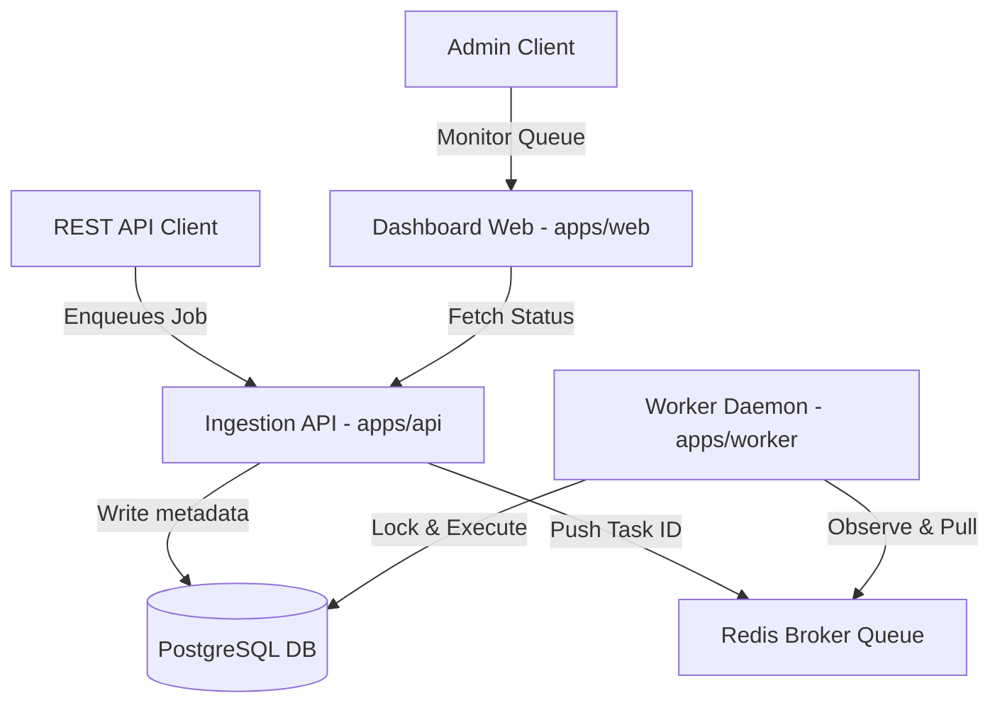

# Distributed Job Scheduler Monorepo

A highly-resilient, production-ready distributed job scheduling infrastructure designed to handle high-throughput background job processing. Built using modern monorepo engineering patterns with pnpm workspaces, Turborepo, TypeScript, ESLint Flat Config, and Docker containerization.

---

## 1. Project Overview

The Distributed Job Scheduler is a microservices-inspired platform engineered to enqueue, schedule, partition, run, and audit asynchronous execution tasks. The repository separates API request ingestion, daemon-based queue processors (Workers), and monitoring portals (Dashboard Web App) into isolated workspace members that share utility libraries and database schemas seamlessly.

## 2. Project Vision

Our vision is to provide an enterprise-grade scheduling framework that guarantees **at-least-once** job execution delivery under network partitions and server crashes. It is designed to scale horizontally to process millions of concurrent jobs while keeping system resource utilization minimal.

## 3. Problem Statement

Modern cloud applications require robust asynchronous processing frameworks. Existing systems often suffer from:

- Tight coupling between API servers and execution daemons, creating bottleneck points.
- Lack of type safety across execution boundaries, leading to runtime failures.
- Complex orchestration and caching layouts that are difficult to manage locally.
- Poor observability into job queue states, performance metrics, and error rates.

This platform addresses these limitations through decoupled services, strong schema verification boundaries, caching runtimes, and a unified monorepo development experience.

## 4. High-Level Architecture

The platform architecture separates write-heavy ingestion routes from processing queues, enabling horizontal scaling at each layer:



## 5. Repository Structure

```
├── apps/
│   ├── api/                 # REST Gateway exposing endpoints to queue jobs
│   ├── worker/              # Processor daemon executing scheduled tasks
│   └── web/                 # Next.js/React monitoring dashboard panel
├── packages/
│   ├── config/              # Central configurations (TypeScript & ESLint base configs)
│   ├── database/            # ORM clients, seeds, and migration controls
│   ├── logger/              # Structured JSON logger library
│   ├── shared/              # Standard types, Zod schemas, and payload interfaces
│   └── utils/               # Common helper packages
├── docs/
│   ├── 00-Engineering/      # Workspace standards, conventions, and DoD guidelines
│   ├── 02-Architecture/     # Sequence diagrams and communication patterns
│   ├── 03-Database/         # Normalization rules, indexes, and migrations strategies
│   ├── 04-API/              # REST endpoint design blueprints
│   └── 06-Testing/          # Test strategies and coverage targets
├── docker/                  # Development and production Dockerfiles
├── scripts/                 # Developer setup and automation utilities
├── .github/                 # Issue templates and PR blueprints
├── .editorconfig            # System-wide formatting guidelines
├── .env.example             # Project environment parameters
├── .gitignore               # Ignored version control paths
├── eslint.config.js         # ESLint Flat configuration
└── turbo.json               # Turborepo task pipeline mappings
```

## 6. Technology Stack

- **Workspace Manager**: [pnpm v10 Workspaces](https://pnpm.io/)
- **Build System**: [Turborepo v2](https://turbo.build/)
- **Programming Language**: [TypeScript v6](https://www.typescriptlang.org/)
- **Linter**: [ESLint v10 (Flat Config)](https://eslint.org/)
- **Formatter**: [Prettier v3](https://prettier.io/)
- **Orchestration**: [Docker Compose v2](https://www.docker.com/)
- **Git Gating Hooks**: [Husky](https://typicode.github.io/husky/) & [lint-staged](https://github.com/okonet/lint-staged)
- **Versioning**: [Changesets v2](https://github.com/changesets/changesets)
- **Commit Format**: [Commitlint](https://commitlint.js.org/) & [Commitizen](https://github.com/commitizen/cz-cli) with `cz-git`

## 7. Development Workflow

We use a gated trunk-based development workflow:

1. Make changes on a branch matching our category prefixes (e.g. `feat/`, `fix/`).
2. Verify code quality locally: `pnpm lint`, `pnpm typecheck`, `pnpm build`.
3. Commit changes using `pnpm commit` (launches interactive Commitizen wizard).
4. Husky enforces `commitlint` checks on the message and executes `lint-staged` on changed files before the commit is finalized.
5. Create a changeset file via `pnpm changeset` for package version bumps.
6. Push to remote, open a Pull Request, and merge to `main` upon approval and green CI.

## 8. Coding Standards

- **Strict Type Enforcement**: `any` is forbidden.
- **Asynchronous Code**: Prefer `async/await` syntax and handle exceptions cleanly using `try/catch`.
- **Modular Design**: Write components following Single Responsibility Principles.
- Detailed standards are available in [Coding Standards](file:///Users/rahulseervi/Documents/GitHub/Distributed-job-Scheduler/docs/00-Engineering/CodingStandards.md) and [Naming Conventions](file:///Users/rahulseervi/Documents/GitHub/Distributed-job-Scheduler/docs/00-Engineering/NamingConventions.md).

## 9. Branching Strategy

- Protect the `main` branch.
- Branches must follow standard prefix rules (e.g., `feat/add-queue`, `fix/db-pool-leak`).
- Review the complete guidelines in [Branch Strategy](file:///Users/rahulseervi/Documents/GitHub/Distributed-job-Scheduler/docs/00-Engineering/BranchStrategy.md).

## 10. Dependency Management

- Install dependencies using `pnpm add <package>` at the target package directory.
- Root dependencies are limited to build/configuration systems (linting, compiling, formatting, git-hooks).
- Reusable local modules are imported using the workspace protocol (e.g. `"@repo/logger": "workspace:*"`).

## 11. Environment Variables

Environment templates are declared in `.env.example`. Duplicate this template into a local `.env` file before starting development. Never commit `.env` files to git.

Key parameters include:

- `DATABASE_URL`: Connection URL for PostgreSQL.
- `REDIS_URL`: Connection URL for Redis caching.
- `API_PORT` & `WORKER_PORT`: Local API/Worker server listening ports.

## 12. Local Development

Get started locally by running:

```bash
# 1. Enable local shims if pnpm is not in your global PATH
corepack enable --install-directory ./node_modules/.bin

# 2. Run developer bootstrap script
./scripts/bootstrap.sh

# 3. Create .env file
./scripts/setup.sh

# 4. Start dev environment
pnpm dev
```

## 13. Docker Support

Local infrastructure containers (PostgreSQL, Redis) and application containers are organized in `docker-compose.yml`.

- Build/Start containers: `docker compose up -d`
- Stop containers: `docker compose down`

## 14. Testing Strategy

Our testing strategy follows the testing pyramid:

- **Unit Tests**: Rapid checking of modules, Zod validation, utils.
- **Integration Tests**: Verification of db queries, redis queue brokers.
- **End-to-End Tests**: Full system boundary verification.
- Review targets in [Testing Strategy](file:///Users/rahulseervi/Documents/GitHub/Distributed-job-Scheduler/docs/06-Testing/TestingStrategy.md).

## 15. Deployment Strategy

The deployment architecture targets containerized cluster runtimes (e.g. AWS ECS, Kubernetes).

- Ingestion API and Worker nodes scale horizontally.
- PostgreSQL database utilizes read replicas.
- Detailed scaling configurations are located in [Scalability Plan](file:///Users/rahulseervi/Documents/GitHub/Distributed-job-Scheduler/docs/02-Architecture/ScalabilityPlan.md).

## 16. Documentation Index

- **Engineering Standards**: Located under [docs/00-Engineering/](file:///Users/rahulseervi/Documents/GitHub/Distributed-job-Scheduler/docs/00-Engineering/)
- **Architectural Designs**: Located under [docs/02-Architecture/](file:///Users/rahulseervi/Documents/GitHub/Distributed-job-Scheduler/docs/02-Architecture/)
- **Database Rules**: Located under [docs/03-Database/](file:///Users/rahulseervi/Documents/GitHub/Distributed-job-Scheduler/docs/03-Database/)
- **API Layouts**: Located under [docs/04-API/](file:///Users/rahulseervi/Documents/GitHub/Distributed-job-Scheduler/docs/04-API/)
- **Testing Standards**: Located under [docs/06-Testing/](file:///Users/rahulseervi/Documents/GitHub/Distributed-job-Scheduler/docs/06-Testing/)

## 17. Roadmap

- **Phase 1**: Infrastructure monorepo setup (Complete).
- **Phase 2**: Database model implementation & Docker containerization integration.
- **Phase 3**: Job scheduler core API & worker queue loops setup.
- **Phase 4**: Security enforcement (JWT, API keys) & monitoring dashboards.

## 18. Contributing Guide

1. Search or create an issue under `.github/ISSUE_TEMPLATE/` mapping the task.
2. Branch out, write code matching [Definition of Done](file:///Users/rahulseervi/Documents/GitHub/Distributed-job-Scheduler/docs/00-Engineering/DefinitionOfDone.md).
3. Verify linter, typecheck, format, and tests pass locally.
4. Submit a Pull Request and ask for code reviews.
