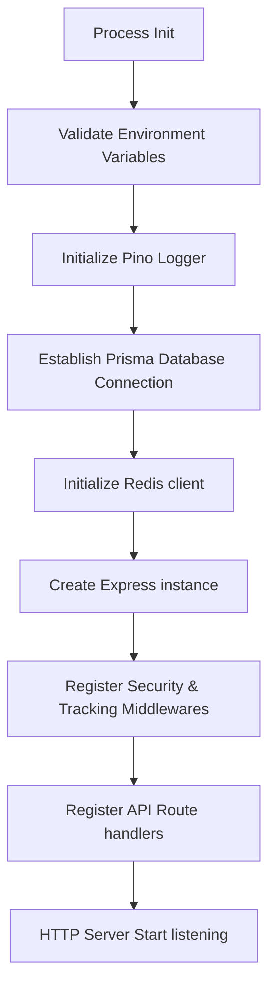

# Production Platform Foundation — API

This package contains the core Express platform infrastructure supporting Zod environment checking, Pino structured logging, Prisma, Redis, custom error handling, and health metrics.

## 1. Startup Flow



---

## 2. Environment Configuration

The app validates configurations immediately at boot using Zod schema parsing. If any values are missing or invalid, the process calls `process.exit(1)` immediately.

Supported environments:

- **`production`**: strict JSON log format, requires valid database URL.
- **`development`**: colorful pretty-printed console log output.
- **`test`**: uses mock database fallbacks to bypass downstream service dependency.

---

## 3. Pino Logging

Logs are structured as JSON in production to support aggregators (e.g. Datadog, Elasticsearch). Each request is assigned a `requestId` and `correlationId` tracking trace logs across microservices.

---

## 4. Centralized Error Handling

All endpoint failures throw typed subclasses extending `BaseError` (e.g., `ValidationError`, `NotFoundError`). The global error handler middleware intercepts exceptions and formats responses following the **RFC 7807 problem details** format:

```json
{
  "type": "https://errors.scheduler.com/validation-error",
  "title": "Validation Error",
  "status": 400,
  "detail": "Request parameter validation failed.",
  "instance": "/api/v1/jobs",
  "invalidParams": [
    {
      "name": "body.priority",
      "reason": "Expected number, received string"
    }
  ]
}
```

---

## 5. Health Telemetry Module

- **`GET /live`**: Returns `200` to confirm the application container is live.
- **`GET /ready`**: Returns `200` (or `503` service unavailable) confirming active connections to both PostgreSQL and Redis.
- **`GET /health`**: Returns detailed latency statistics, CPU/heap memory usages, version, and server environment.
