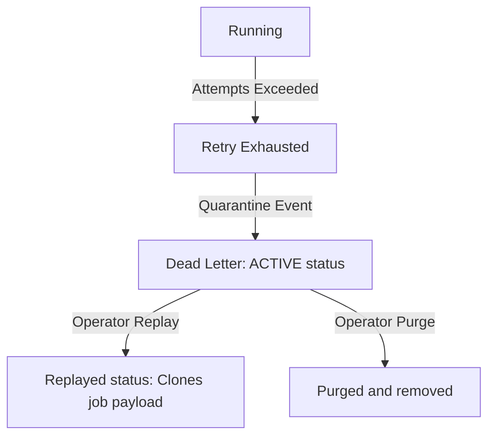

# DLQ Lifecycle

This document describes the quarantine state transition path.

- When a job exhausts all automatic retry slots, it is quarantined inside `DeadLetterEntry` table.
- Entries remain ACTIVE until replayed or purged.
