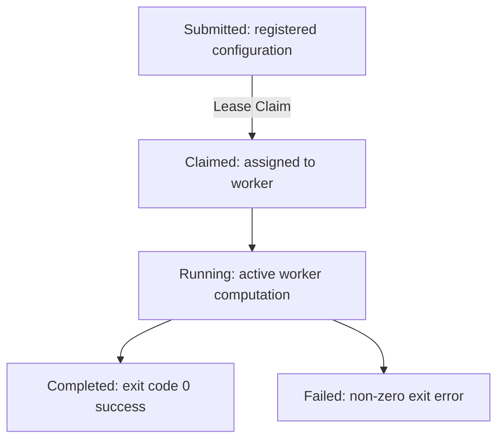

# Execution Timeline

This document details runtime job state transition lines.

- Timestamps for every lifecycle transition are recorded and displayed chronologically.
- Timing summaries compute active execution processing duration.
