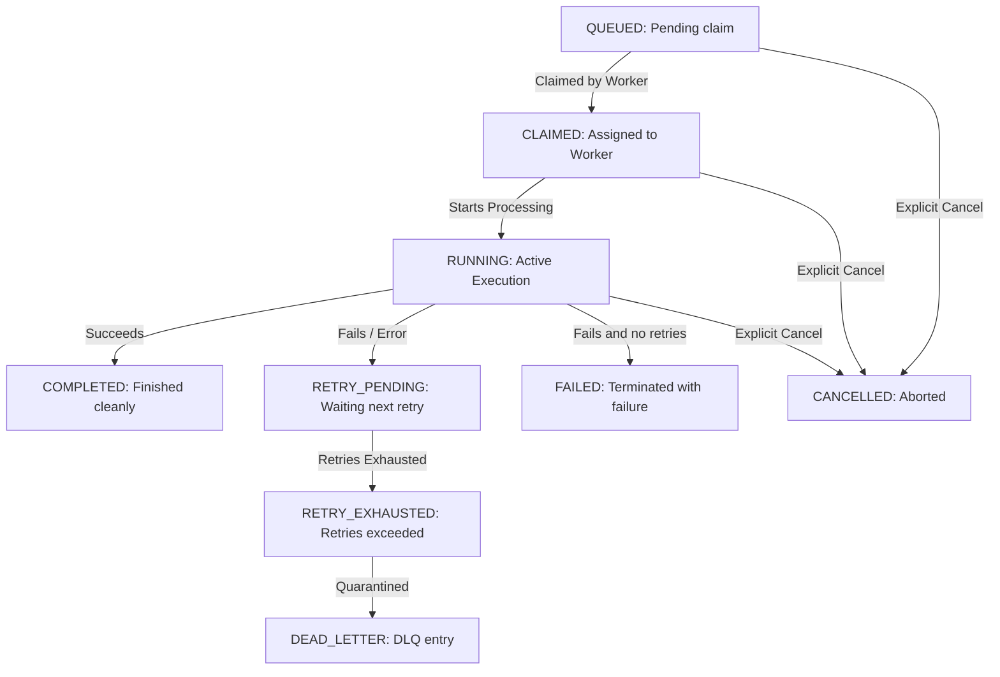

# Job Lifecycle

This document describes the state lifecycle sequences and visual flows of scheduler jobs.

- Preceding stages render in successful green styling, while current step highlights blue.
- Terminated final states format according to success (green), failure (red), or cancelled (gray).
