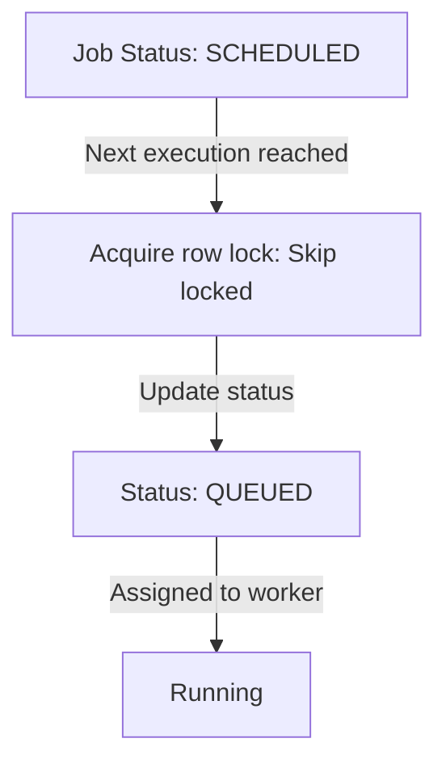

# Promotion Lifecycle

This document outlines the scheduled task promotion workflow.

- Every loop cycle fetches eligible scheduled tasks where executing timestamps are in the past.
- Candidates are promoted by batch updates.
