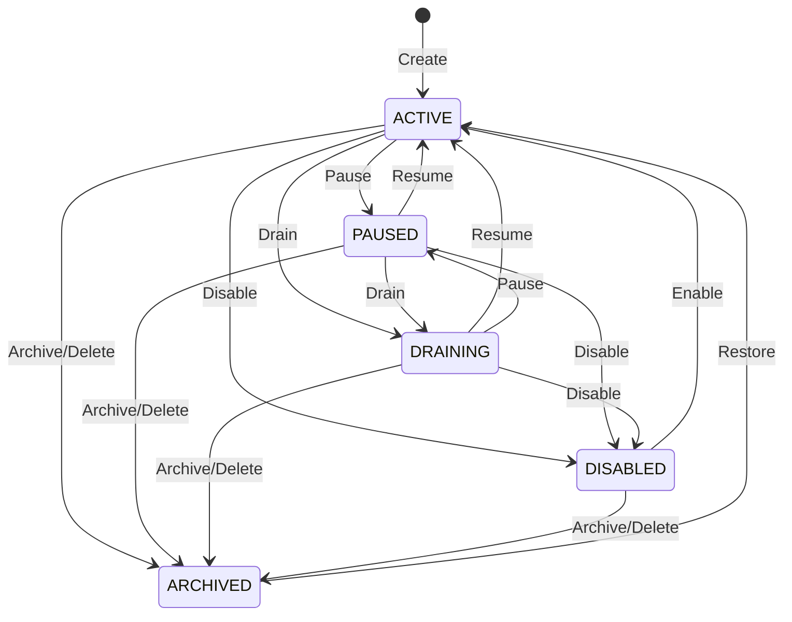

# Queue State Machine

This document details client state transitions matching the scheduler engine constraints.

- Operational controls render dynamically according to current state.
- Invalid state transition buttons are disabled.
