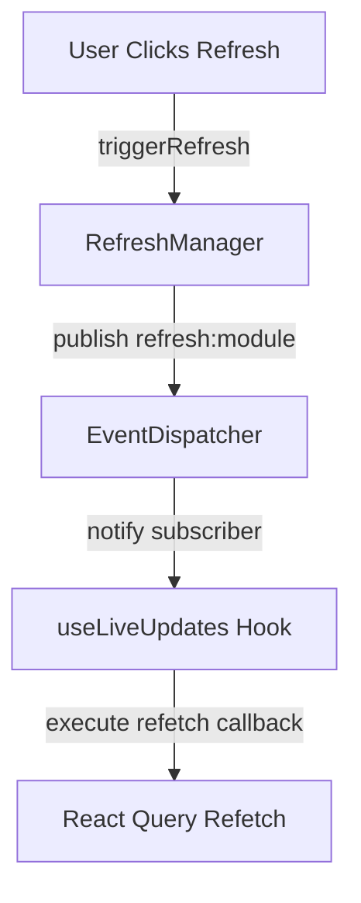

# Refresh Lifecycle

This document describes the manual refresh execution path.

```mermaid
graph TD
    UserClick[User Clicks Refresh] -->|triggerRefresh| RefreshManager[RefreshManager]
    RefreshManager -->|publish refresh:module| EventDispatcher[EventDispatcher]
    EventDispatcher -->|notify subscriber| useLiveUpdates[useLiveUpdates Hook]
    useLiveUpdates -->|execute refetch callback| ReactQuery[React Query Refetch]
```

- Ensures that calling manual refresh broadcasts to all panels in the module immediately.
