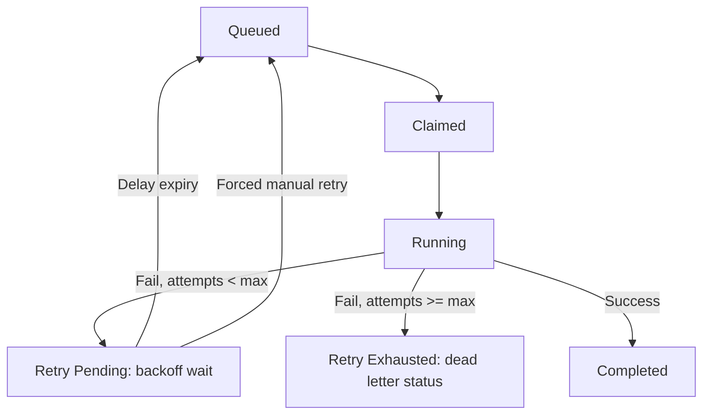

# Retry Lifecycle

This document describes automatic job retry loop transitions.

- Lost worker or exception execution failures trigger the backoff scheduler.
- Failed status nodes can be manually forced enqueued by operators.
