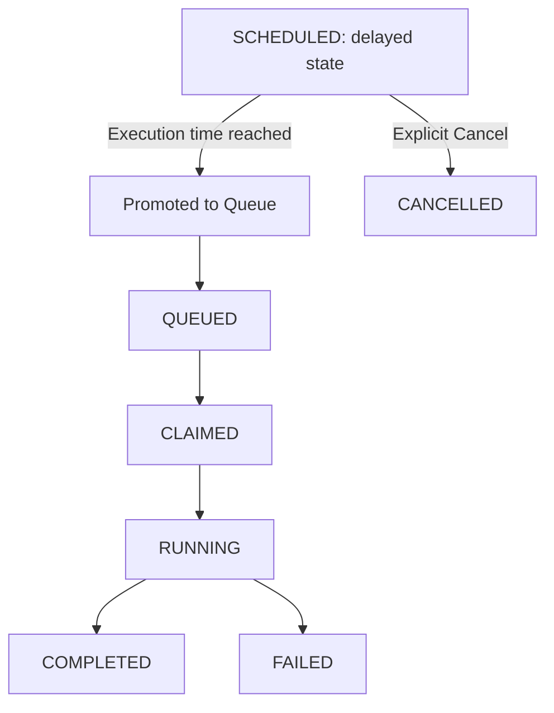

# Scheduling Flow

This document details scheduled execution flows and state transitions.

- Promoted runtime jobs link directly to their parent telemetry configurations.
- Cancel scheduled job actions immediately terminate future executions.
