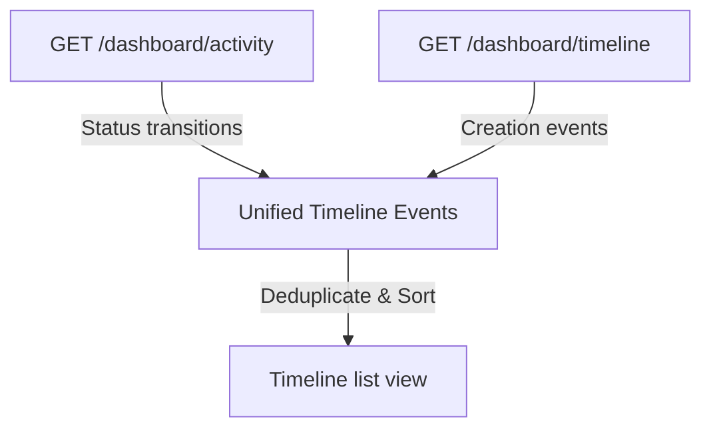

# Timeline Architecture

This document maps chronological telemetry flows.

- Converts discrete backend status records into a single continuous visual feed.
- Unified structures display execution logs in reverse chronological order.
