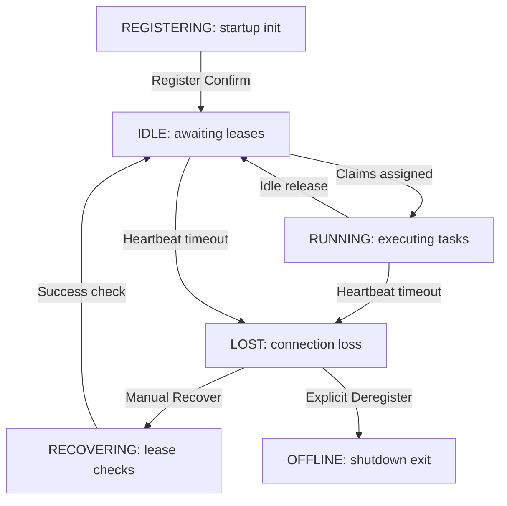

# Worker Lifecycle

This document describes worker node status states and transition paths.

- Lost worker nodes can be manually recovered or deregistered by administrators.
- Status visualizations reuse the shared indicators color mappings.
