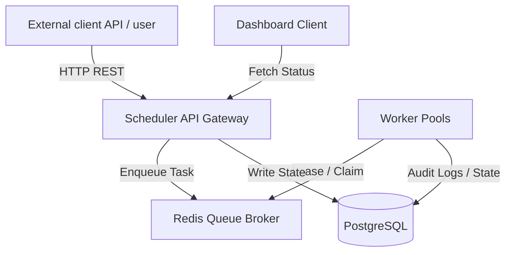
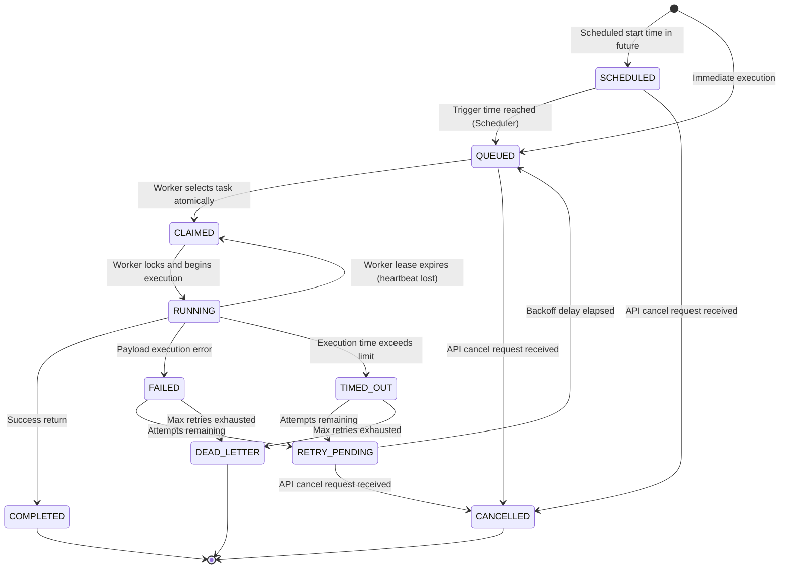
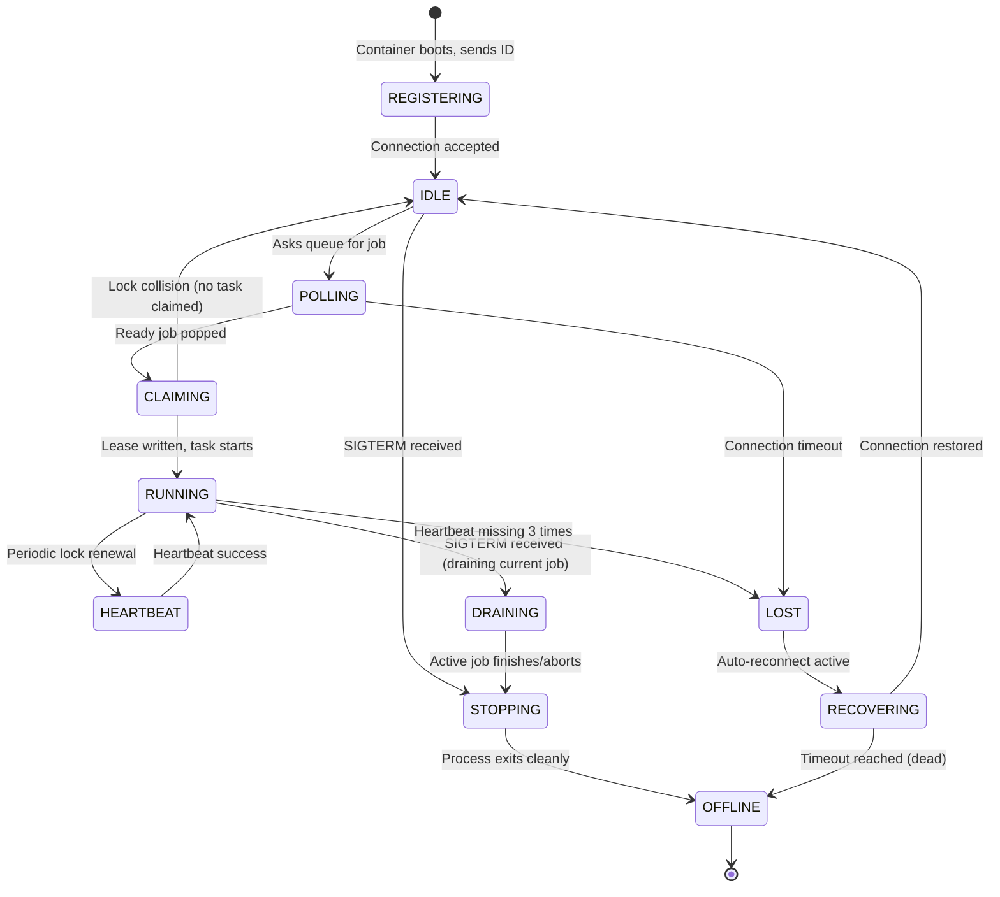
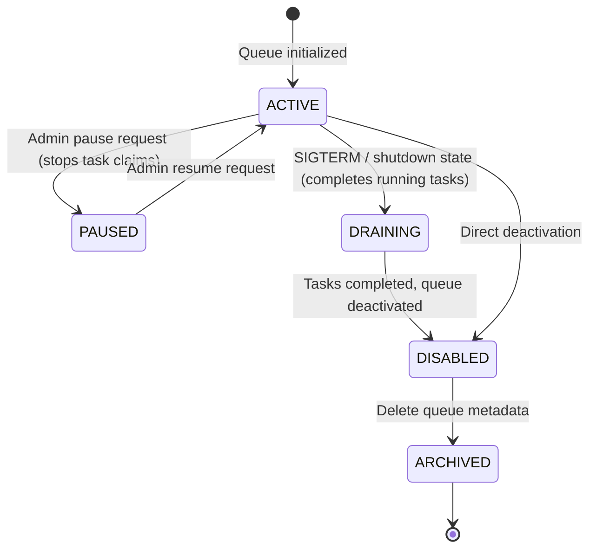

# Software Requirements Specification (SRS)

**Document Version**: 1.0.0  
**Status**: APPROVED  
**Author**: Principal Software Architect  
**Last Updated**: 2026-07-02

---

## Revision History

| Version | Date       | Description                             | Author              |
| :------ | :--------- | :-------------------------------------- | :------------------ |
| 1.0.0   | 2026-07-02 | Initial release for Architecture Review | Principal Architect |

---

## Table of Contents

1. [Introduction](#1-introduction)
2. [Purpose](#2-purpose)
3. [Scope](#3-scope)
4. [Definitions](#4-definitions)
5. [Assumptions](#5-assumptions)
6. [Constraints](#6-constraints)
7. [Dependencies](#7-dependencies)
8. [Functional Overview](#8-functional-overview)
9. [Non-Functional Overview](#9-non-functional-overview)
10. [System Context](#10-system-context)
11. [Operating Environment](#11-operating-environment)

---

## 1. Introduction

This Software Requirements Specification (SRS) describes the architectural and system-level requirements for the Distributed Job Scheduler monorepo. It details the boundaries, performance characteristics, API expectations, and system context of the scheduling engine.

## 2. Purpose

This document provides a single source of truth for engineering teams during development and testing phases. It specifies target interfaces, performance thresholds, availability requirements, security targets, and system boundaries.

## 3. Scope

The scheduling engine is designed to run in cloud environments. It coordinates:

- A high-throughput REST Gateway (`apps/api`) for job creation.
- A cluster of decoupled Worker Daemons (`apps/worker`) claiming and running jobs.
- Shared libraries for logging, database validation, and common tools (`packages/*`).
- System-wide tracking, retry mechanics, lease locking, and DLQ containment.

## 4. Definitions

For definitions of key terms used in this document (such as organization, lease, heartbeat, atomic claim, and DLQ), please refer to the project [Glossary](file:///Users/rahulseervi/Documents/GitHub/Distributed-job-Scheduler/docs/01-Requirements/Glossary.md).

## 5. Assumptions

For detailed assumptions regarding the development and runtime environment, please refer to the project [Assumptions Specification](file:///Users/rahulseervi/Documents/GitHub/Distributed-job-Scheduler/docs/01-Requirements/Assumptions.md).

## 6. Constraints

For technical, stack-related, and business limitations, please refer to the [Constraints Specification](file:///Users/rahulseervi/Documents/GitHub/Distributed-job-Scheduler/docs/01-Requirements/Constraints.md).

## 7. Dependencies

The scheduler platform relies on the following external runtimes:

- **Node.js LTS (v24.x)**: Runtime engine.
- **PostgreSQL (v16.x)**: Relational database for system metadata, persistence, auditing, and tenant states.
- **Redis (v7.x)**: High-speed caching server and queue broker (handling task dispatches and worker lease trackers).

## 8. Functional Overview

The scheduler coordinates work items across multiple queues.

- Developers submit jobs via JSON REST APIs.
- The API gateway validates payloads, writes jobs to the database, and schedules triggers.
- Active workers claim ready jobs via Redis transactions, execute the payload, renew leases periodically, and record execution logs in PostgreSQL.
- Over-running or failed jobs trigger retries or are moved to the DLQ.

## 9. Non-Functional Overview

- **SLA**: `99.99%` system availability target.
- **Scale**: The API must handle `5,000` concurrent requests per second.
- **Latency**: Scheduling latency must be `< 500ms` from trigger time.
- **Security**: Mandatory JWT authentication and token boundaries.

## 10. System Context

The system interacts with external entities as shown in the block diagram:

11. [Operating Environment](#11-operating-environment)
12. [Role-Based Access Control (RBAC) Model](#12-role-based-access-control-rbac-model)
13. [Lifecycle State Machines](#13-lifecycle-state-machines)
14. [Failure Scenario Catalogue](#14-failure-scenario-catalogue)
15. [Architectural Decisions](#15-architectural-decisions)

---

## 1. Introduction

[UNCHANGED]

## 11. Operating Environment

- **Infrastructure**: Linux-based containers (Docker/Kubernetes).
- **Time Synchronization**: Mandatory Network Time Protocol (NTP) synchronization across all nodes to prevent scheduling drift.
- **Database Limits**: Connection pool values dynamically configured to prevent thread exhaustion.

## 12. Role-Based Access Control (RBAC) Model

We define a role-based access control authorization model to govern the API gateway and monitoring dashboard scopes.

### 12.1. System Administrator

- **Responsibilities**: Oversees global cluster infrastructure, global resource quotas, system configurations, and tenant setups.
- **Allowed Operations**: Create/Delete Organizations, manage system settings, view system metrics across all tenants, override queue limits, and manage global worker registrations.
- **Restricted Operations**: None (root access).
- **Scope of Access**: Global (system-wide across all organizations).

### 12.2. Organization Owner

- **Responsibilities**: Primary tenant owner. Owns billing, compliance, and user permissions inside a single organization.
- **Allowed Operations**: Modify organization details, delete their organization, create projects, configure organization permissions, invite/revoke users, and manage billing.
- **Restricted Operations**: Modify global System Settings or view metrics of other organizations.
- **Scope of Access**: Single Organization.

### 12.3. Organization Administrator

- **Responsibilities**: Handles operational administration tasks for the organization's projects and members.
- **Allowed Operations**: Invite users, manage permissions (except Organization Owner roles), create/delete projects, manage queues, pause/resume queues, and view organization-wide logs/metrics.
- **Restricted Operations**: Delete the Organization, change billing owners, or modify system settings.
- **Scope of Access**: Single Organization.

### 12.4. Project Maintainer

- **Responsibilities**: Owns the lifecycle of a specific project's queues, configurations, and schedules.
- **Allowed Operations**: Create/Modify/Pause/Resume queues, configure retry policies, purge jobs, manage projects-specific worker associations, and retry/cancel jobs.
- **Restricted Operations**: Create/Delete projects, modify organization parameters, or access other projects.
- **Scope of Access**: Selected Projects.

### 12.5. Developer

- **Responsibilities**: Integrates client applications by scheduling and monitoring jobs.
- **Allowed Operations**: Create jobs, view logs, view project-level execution metrics, retry jobs, cancel pending jobs, and manage API keys for project environments.
- **Restricted Operations**: Create/Delete queues, pause/resume queues, modify project variables, or delete jobs.
- **Scope of Access**: Selected Projects.

### 12.6. Read-Only Viewer

- **Responsibilities**: Auditing and observing queue states without permission to modify resources.
- **Allowed Operations**: View job execution lists, view logs, view project dashboard metrics, and view queue states.
- **Restricted Operations**: Create, delete, pause, resume, cancel, or retry any job, queue, or project.
- **Scope of Access**: Selected Projects.

---

## 13. Lifecycle State Machines

This section formally specifies the state machines governing Jobs, Workers, and Queues.

### 13.1. Job Lifecycle State Machine

#### State Definitions

- **SCHEDULED**: The job is stored in PostgreSQL with a `scheduled_at` timestamp set in the future.
- **QUEUED**: The job's scheduled time has arrived. It is pushed as a task reference in the Redis queue and PostgreSQL state updates to `QUEUED`.
- **CLAIMED**: A worker has atomically popped the task reference from Redis and holds a lease lock.
- **RUNNING**: The worker has started executing the payload and is reporting heartbeats.
- **COMPLETED**: The job executed successfully. Logs are archived, state updates to `COMPLETED` in PostgreSQL, and the job is deleted from active execution brokers.
- **FAILED**: The job threw a runtime error.
- **TIMED_OUT**: The job exceeded its maximum allowed execution timeout.
- **RETRY_PENDING**: The job failed or timed out but has retry attempts remaining. It is delayed based on exponential backoff rules.
- **CANCELLED**: The job was aborted by an administrator prior to completion.
- **DEAD_LETTER**: Max retries have been exhausted. The job is placed in the DLQ for manual audit.

---

### 13.2. Worker Lifecycle State Machine

---

### 13.3. Queue Lifecycle State Machine

---

## 14. Failure Scenario Catalogue

### 14.1. Worker Crash During Execution

- **Detection**: Heartbeat lock key in Redis expires (Worker stops renewing the lease).
- **Recovery Strategy**: The background sweep task detects the expired lease in PostgreSQL, marks the execution attempt as failed, and enqueues a retry (or moves it to the DLQ if retries are exhausted).
- **Consistency Guarantees**: PostgreSQL transactions track execution attempts. The job is never lost.
- **User-Visible Impact**: Temporary execution delay; job status is automatically restored and completed by another worker.
- **Monitoring Requirements**: Alert if worker crash rate per queue exceeds 5% in 15 minutes.

### 14.2. Worker Heartbeat Timeout

- **Detection**: The Redis heartbeat lease key is not updated within the configured interval (e.g. 10 seconds).
- **Recovery Strategy**: Same as worker crash. The job lease is revoked and the task is rescheduled.
- **Consistency Guarantees**: Guarded by PostgreSQL job states; old worker is blocked from writing results once its lease expires (enforced via database checks on final write).
- **User-Visible Impact**: Delayed job completion.
- **Monitoring Requirements**: Log heartbeat expirations as warnings.

### 14.3. Database (PostgreSQL) Temporary Outage

- **Detection**: Connection pool drivers report database timeouts or failures to query.
- **Recovery Strategy**: API gateways and workers retry connection attempts using exponential backoffs. Workers hold jobs in memory (blocking execution progress) until connection returns.
- **Consistency Guarantees**: Database transactions rollback uncommitted changes. Job states inside Redis are preserved.
- **User-Visible Impact**: API request timeouts (503 Service Unavailable) and dashboard sync pauses.
- **Monitoring Requirements**: Page database administration teams immediately if outage exceeds 10 seconds.

### 14.4. Redis Queue Broker Outage

- **Detection**: Connection failure reported by Redis client drivers in API or worker nodes.
- **Recovery Strategy**: API gateways block job ingestion with a 503 error. Workers pause queue polling. Once Redis recovers, workers reconcile current active states with PostgreSQL database.
- **Consistency Guarantees**: PostgreSQL remains the source of truth. Any active job in PostgreSQL that was not committed as completed is re-enqueued to Redis upon connection recovery.
- **User-Visible Impact**: Complete service disruption for new job scheduling.
- **Monitoring Requirements**: High-priority alert page immediately upon disconnect.

### 14.5. Scheduler Node Restart

- **Detection**: Liveness probe failure on scheduler container.
- **Recovery Strategy**: Active scheduler replicas take over cron ticks immediately using distributed locks.
- **Consistency Guarantees**: Cron triggers are calculated based on UTC timestamps. Schedulers scan for missed cron runs and perform catch-up triggers.
- **User-Visible Impact**: None.
- **Monitoring Requirements**: Log container restart warnings.

### 14.6. Ingestion API Node Restart

- **Detection**: Gateway load balancer health check failure.
- **Recovery Strategy**: Load balancer routes HTTP requests to online API replicas.
- **Consistency Guarantees**: Inflight requests aborted before database write return 5xx to clients to safely retry.
- **User-Visible Impact**: Minor transient HTTP timeouts.
- **Monitoring Requirements**: Standard container alerts.

### 14.7. Duplicate Job Delivery Attempt

- **Detection**: Unique constraints checks in PostgreSQL (e.g. scheduling duplicate unique idempotency keys).
- **Recovery Strategy**: The API rejects duplicate scheduling requests with a 409 Conflict status.
- **Consistency Guarantees**: Database unique index guards against duplicates.
- **User-Visible Impact**: None (the API informs client the job is already enqueued).
- **Monitoring Requirements**: Log as info.

### 14.8. Lease Expiration

- **Detection**: Job lease duration elapsed in the database.
- **Recovery Strategy**: Lock is released, task status transitions back to `QUEUED`.
- **Consistency Guarantees**: Any write attempts from the expired worker thread are rejected via optimistic locking.
- **User-Visible Impact**: Job executes a second time (at-least-once guarantee).
- **Monitoring Requirements**: Log warning.

### 14.9. Clock Drift

- **Detection**: Clock skew checks (NTP monitoring daemon alerts if drift exceeds 50ms).
- **Recovery Strategy**: Discrepancies are flagged. Automated node restarts sync machine clocks.
- **Consistency Guarantees**: PostgreSQL server clock acts as the database timezone reference.
- **User-Visible Impact**: Minor delay variations.
- **Monitoring Requirements**: Page SRE if drift exceeds 100ms.

### 14.10. Network Partition

- **Detection**: Network connection timeouts between subnets.
- **Recovery Strategy**: If workers lose access to Redis/DB, they stop processing new jobs and enter recovery reconnect loops.
- **Consistency Guarantees**: Heartbeat timeouts protect the queue; once partition heals, expired leases are reassigned.
- **User-Visible Impact**: Job processing delays.
- **Monitoring Requirements**: Page immediately.

### 14.11. Retry Exhaustion

- **Detection**: Job execution fails and attempt count reaches retry limit.
- **Recovery Strategy**: Job moves automatically to `DEAD_LETTER` state.
- **Consistency Guarantees**: Job status state written to PostgreSQL database.
- **User-Visible Impact**: Job flagged as `DEAD` on dashboard, trigger alert.
- **Monitoring Requirements**: Alert on Slack/PagerDuty.

### 14.12. Dead Letter Queue Overflow

- **Detection**: Count of jobs in `DEAD` state exceeds threshold limit per project (e.g. 10,000 tasks).
- **Recovery Strategy**: API rejects moving new failed tasks to `DEAD` by throwing alert and writing emergency logs, forcing operational intervention.
- **Consistency Guarantees**: Logs stored locally.
- **User-Visible Impact**: System backpressure alerts.
- **Monitoring Requirements**: High-priority operations alert.

### 14.13. Queue Pause While Jobs are Running

- **Detection**: Paused flag updated in Database/Redis.
- **Recovery Strategy**: Running jobs are allowed to complete. No new tasks are claimed by workers.
- **Consistency Guarantees**: State updates written to Database.
- **User-Visible Impact**: Remaining jobs wait in queue.
- **Monitoring Requirements**: Info logs.

### 14.14. Queue Deletion With Active Queued Jobs

- **Detection**: API delete queue request.
- **Recovery Strategy**: Deletion is blocked unless the queue is paused and drained, or administrator overrides with force parameter.
- **Consistency Guarantees**: Prevent accidental database cascade deletions.
- **User-Visible Impact**: Error response on API deletion attempt.
- **Monitoring Requirements**: Admin audit log.

---

## 15. Architectural Decisions

### 15.1. Queue Storage: PostgreSQL as the Source of Truth

- **Decision**: PostgreSQL is the single authoritative source of truth for all job states. Redis is used strictly for scheduling acceleration, distributed locks, rate-limiting, and caching.
- **Rationale**: PostgreSQL provides transactional ACID guarantees, complex relational queries, audit trails, and data persistence. Using Redis as the primary database introduces risks of data loss (in memory) and state drift. By keeping job metadata in PostgreSQL and enqueuing task references in Redis, we combine the performance of memory queues with database durability.

### 15.2. Dead Letter Queue (DLQ) Retention Policy

- **Decision**: Confined jobs in the Dead Letter Queue (`DEAD_LETTER` state) have a default retention limit of 30 days. This limit is configurable per queue. Expired records are deleted or archived based on queue settings.
- **Rationale**: Infinite retention of failed jobs causes database bloat. 30 days provides ample time for developers to audit logs, fix payload codes, and replay failures.

### 15.3. Fixed Lease Strategy Configured at Queue Level

- **Decision**: Job execution leases utilize fixed durations configured per queue (e.g. 5 minutes for `transactions` queue). We reject dynamic lease sizing based on payload weights.
- **Rationale**: Dynamic lease sizing introduces high complexity and unpredictability. Fixed queue-level leases are simple to configure, easy to reason about, and match standard container resource allocation policies.
