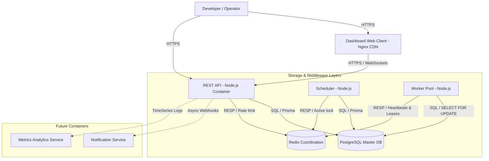

# C4 Container Diagram

**Document Version**: 1.1.0  
**Status**: APPROVED  
**Author**: Principal Software Architect  
**Last Updated**: 2026-07-02

---

## Revision History

| Version | Date       | Description                                                 | Author              |
| :------ | :--------- | :---------------------------------------------------------- | :------------------ |
| 1.1.0   | 2026-07-02 | Remediation: PostgreSQL queue ownership & SQL lock claiming | Principal Architect |
| 1.0.0   | 2026-07-02 | Initial release for Architecture Review                     | Principal Architect |

---

## Table of Contents

1. [Container Specifications](#1-container-specifications)
2. [C4 Container Diagram](#2-c4-container-diagram)

---

## 1. Container Specifications

### 1.1. Dashboard Web Client

- **Responsibilities**: Web operator dashboard.
- **Interfaces**: Browser-based HTML/CSS, connecting to APIs via HTTPS and WebSockets.
- **Dependencies**: REST API.
- **Scaling**: Static file deployment (CDN caching).
- **Failure Impact**: Operators cannot view statuses; core job processing is unaffected.

### 1.2. REST API Gateway

- **Responsibilities**: Authenticates request tokens, validates payload structures, writes job rows directly to PostgreSQL database.
- **Interfaces**: REST HTTP API endpoints.
- **Dependencies**: PostgreSQL, Redis (rate limiting), OAuth Provider.
- **Scaling**: Horizontally scales behind an ALB based on CPU/Request count metrics.
- **Failure Impact**: Clients cannot schedule or cancel jobs.

### 1.3. Worker Service

- **Responsibilities**: Long-lived background containers polling PostgreSQL, claiming tasks atomically via row-level locks, executing payloads, and renewing leases.
- **Interfaces**: Polling loops claiming tasks via `SELECT ... FOR UPDATE SKIP LOCKED` and updating states in PostgreSQL.
- **Dependencies**: Redis (leases/heartbeats), PostgreSQL, Logger.
- **Scaling**: Horizontally scales based on Queue backpressure (pending tasks count in database) metrics.
- **Failure Impact**: Jobs in queues remain pending. Worker crashes trigger automatic lease expirations and rescheduling.

### 1.4. Scheduler Engine

- **Responsibilities**: Evaluates cron expressions and promotes scheduled jobs whose scheduled time has elapsed directly in PostgreSQL.
- **Interfaces**: Loop queries to PostgreSQL. Pushes optional wake-up signals to Redis Pub/Sub.
- **Dependencies**: PostgreSQL, Redis (distributed active locks).
- **Scaling**: Scales via active-passive locks (only 1 active node schedules to prevent duplicates).
- **Failure Impact**: Cron and delayed jobs do not execute until a backup node claims the active lock.

### 1.5. Redis Coordination Node

- **Responsibilities**: High-speed distributed locking, heartbeat lease tracking, rate limiting, and wake-up notifications. Redis does NOT own or store jobs.
- **Interfaces**: Redis RESP connection protocol.
- **Dependencies**: None.
- **Scaling**: Clustered layout with primary-secondary replication.
- **Failure Impact**: Workers cannot heartbeat and fail safe. Schedulers fail to coordinate active locks.

### 1.6. PostgreSQL Database

- **Responsibilities**: Authoritative storage of all job metadata, queues, executions, logs, accounts, and project configurations.
- **Interfaces**: SQL connection client pools.
- **Dependencies**: None.
- **Scaling**: Vertical scale-up, primary-replica read partitions, and pgBouncer connection pools.
- **Failure Impact**: Complete platform freeze. APIs block; workers fail to commit executions.

---

## 2. C4 Container Diagram

