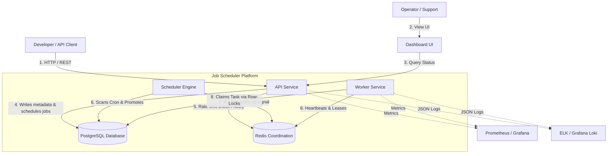

# C4 Context Diagram

**Document Version**: 1.1.0  
**Status**: APPROVED  
**Author**: Principal Software Architect  
**Last Updated**: 2026-07-02

---

## Revision History

| Version | Date       | Description                                                 | Author              |
| :------ | :--------- | :---------------------------------------------------------- | :------------------ |
| 1.1.0   | 2026-07-02 | Remediation: PostgreSQL queue ownership & SQL lock claiming | Principal Architect |
| 1.0.0   | 2026-07-02 | Initial release for Architecture Review                     | Principal Architect |

---

## Table of Contents

1. [System Context Definitions](#1-system-context-definitions)
2. [C4 Context Diagram](#2-c4-context-diagram)

---

## 1. System Context Definitions

### Users

- **Developer / API Clients**: Interact programmatically with API gateways to schedule and cancel tasks.
- **Operations / Support Operators**: Access dashboards to monitor queue backlogs, configure rate limits, and inspect dead letter logs.

### Systems inside Boundaries

- **Dashboard (`apps/web`)**: Web UI displaying execution statistics.
- **API Service (`apps/api`)**: REST API gateway validating requests and updating PostgreSQL job records.
- **Worker Service (`apps/worker`)**: Daemon runtimes claiming and executing tasks directly from PostgreSQL.
- **Scheduler**: Evaluation node promoting scheduled/cron jobs directly in PostgreSQL.
- **PostgreSQL**: Authoritative database owner of: Organizations, Projects, Queues, Jobs, Job Executions, Retry History, Dead Letter Queue, and Worker Metadata.
- **Redis**: In-memory cache handling rate limits, distributed locking, heartbeat tracking, and scheduler notifications. Redis does NOT own or store jobs.

---

## 2. C4 Context Diagram

