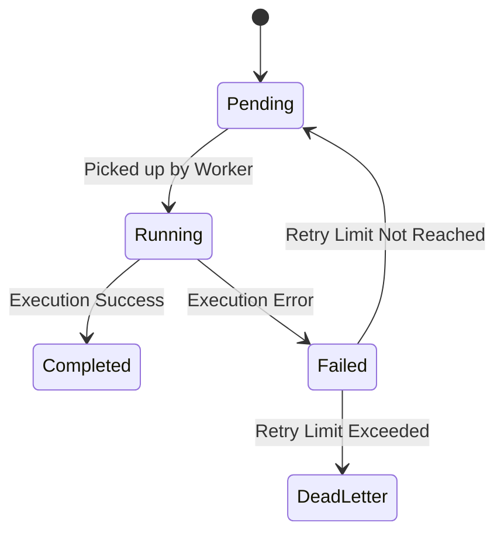

# Data Flow

This document details data mutation paths and lifecycle states of jobs.

## 1. Job Lifecycle States

## 2. Ingestion Path Flow

- **Input**: REST client schedules a task.
- **Validation**: Schema checks.
- **Store**: SQL metadata creation.
- **Publish**: Broker task dispatch.
