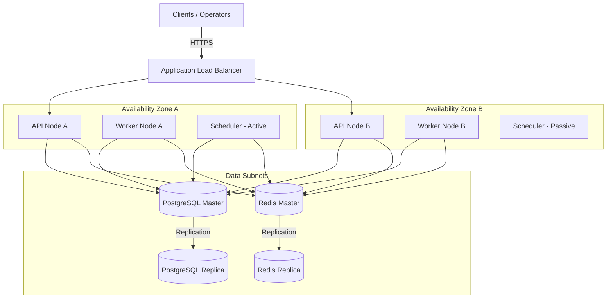

# Deployment Architecture Design

**Document Version**: 1.1.0  
**Status**: APPROVED  
**Author**: Principal Software Architect  
**Last Updated**: 2026-07-02

---

## Revision History

| Version | Date       | Description                                                 | Author              |
| :------ | :--------- | :---------------------------------------------------------- | :------------------ |
| 1.1.0   | 2026-07-02 | Remediation: PostgreSQL queue ownership & SQL lock claiming | Principal Architect |
| 1.0.0   | 2026-07-02 | Initial release for Architecture Review                     | Principal Architect |

---

## Table of Contents

1. [Target Production Infrastructure](#1-target-production-infrastructure)
2. [Auto-Scaling Policies](#2-auto-scaling-policies)
3. [Auto-Recovery & Failover](#3-auto-recovery--failover)
4. [Deployment Diagram](#4-deployment-diagram)

---

## 1. Target Production Infrastructure

The deployment layout utilizes standard cloud container orchestration platforms (AWS ECS/Fargate or Kubernetes GKE) deployed across multiple availability zones (AZs) for high availability.

### 1.1. Network Topology

- **Public Subnets**: Host the Application Load Balancer (ALB).
- **Private App Subnets**: Host the API containers, worker daemons, and scheduler engines. No direct public ingress is allowed.
- **Isolated Database Subnets**: Host PostgreSQL master-replica pairs and Redis cluster instances.

### 1.2. Containers Config

- **API Containers**: Dynamically scaled based on CPU and concurrent connections.
- **Worker Pools**: Grouped in clusters based on queue types (e.g. `transactions-worker-pool` vs. `emails-worker-pool`).
- **Scheduler Nodes**: Run in active-passive configurations.

---

## 2. Auto-Scaling Policies

- **API Scale-Out**: Auto-scales container counts when CPU utilization exceeds `70%` or active TCP connection count exceeds `2,000` per node.
- **Worker Scale-Out**: Scaled horizontally based on queue backpressure:
  - If `Queue Length (Pending Tasks in PostgreSQL) / Active Workers > 50` for more than 2 minutes, spawn another worker container instance.
  - Scale down when the backlog is cleared.

---

## 3. Auto-Recovery & Failover

- **Load Balancer Health Probes**:
  - API and worker nodes expose `/health` and `/ready` probes.
  - Failing the probe restarts the container.
- **PostgreSQL Failover**:
  - Utilizes Multi-AZ managed databases (e.g. AWS RDS Aurora). Since PostgreSQL owns all queues and states, automatic failover to the standby replica is critical and completes in under 30 seconds (RTO target).
- **Redis Failover**:
  - Redis sentinel or cluster manages nodes failover. Since Redis only stores heartbeats, transient connection timeouts do not cause data loss.

---

## 4. Deployment Diagram

