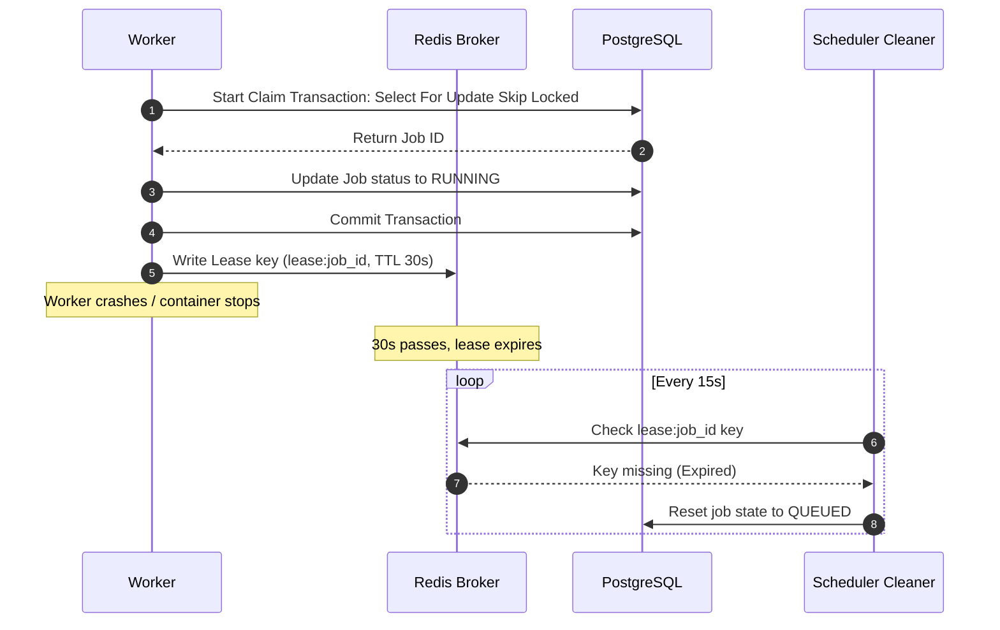
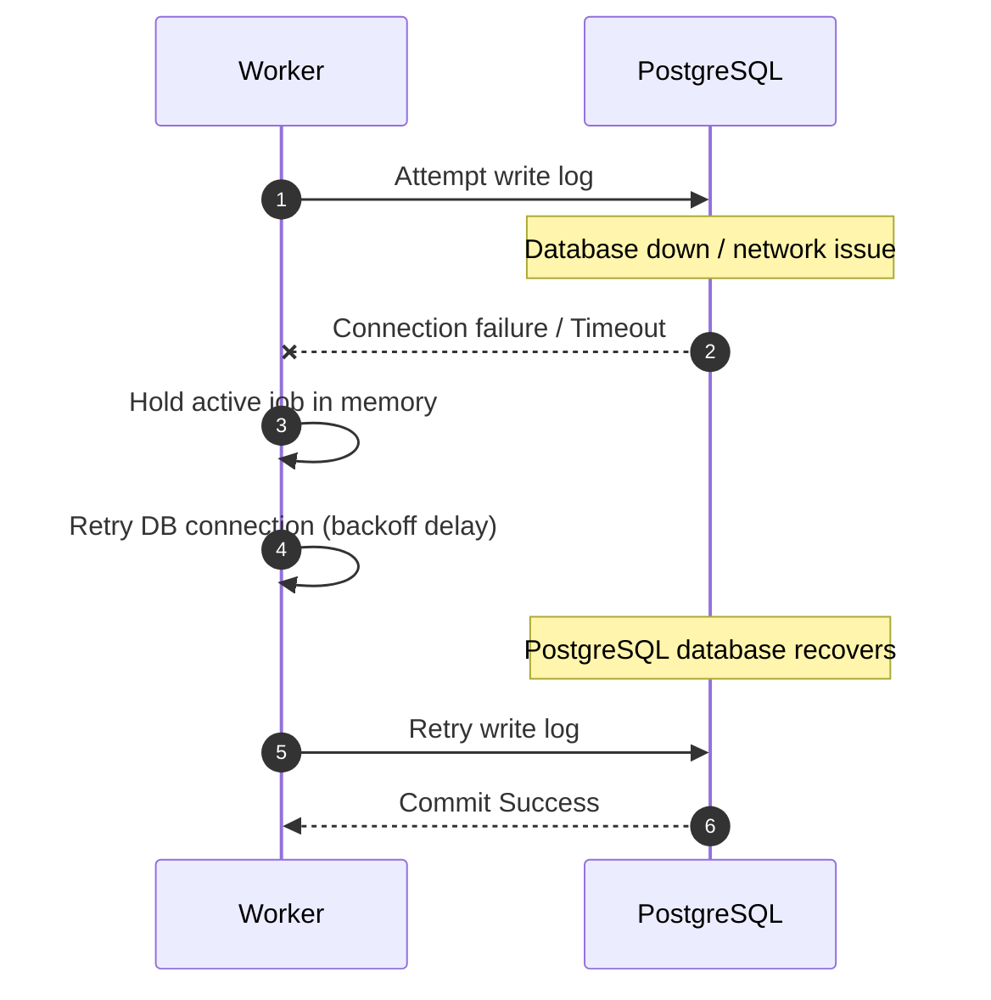

# Failure Recovery Architecture Design

**Document Version**: 1.1.0  
**Status**: APPROVED  
**Author**: Principal Software Architect  
**Last Updated**: 2026-07-02

---

## Revision History

| Version | Date       | Description                                                 | Author              |
| :------ | :--------- | :---------------------------------------------------------- | :------------------ |
| 1.1.0   | 2026-07-02 | Remediation: PostgreSQL queue ownership & SQL lock claiming | Principal Architect |
| 1.0.0   | 2026-07-02 | Initial release for Architecture Review                     | Principal Architect |

---

## Table of Contents

1. [Recovery Lifecycles & Timelines](#1-recovery-lifecycles--timelines)
2. [Data Consistency & Reconciliation Guarantees](#2-data-consistency--reconciliation-guarantees)
3. [Recovery Sequence Diagrams](#3-recovery-sequence-diagrams)

---

## 1. Recovery Lifecycles & Timelines

The platform defines target timelines for automatic recovery from node failures:

- **Worker Crash Recovery**: `< 45 seconds`.
  - Heartbeat lock in Redis expires after 30 seconds.
  - The background cleaner task detects the expired lease, aborts the attempt in PostgreSQL, and enqueues a retry within 15 seconds.
- **Database Failover (PostgreSQL Master)**: `< 30 seconds`.
  - The managed database service detects master node failure and promotes the read replica.
  - Applications retry connection attempts using exponential backoffs.
- **Redis Broker Outage Recovery**: `< 10 seconds` failover.
  - Since Redis only handles heartbeats and locking coordination, an outage does not impact core job states. Workers run safe-fail loops and retry connections.

---

## 2. Data Consistency & Reconciliation Guarantees

Since PostgreSQL is the sole authoritative owner of all job states:

- Active jobs do not risk synchronization drift between Redis and PostgreSQL.
- If Redis reboots and loses heartbeat cache data, workers automatically write their active lease metadata back to Redis during their next heartbeat tick.

---

## 3. Recovery Sequence Diagrams

### 3.1. Worker Crash & Job Rescheduling Flow

### 3.2. Database Connection Lost Handling

