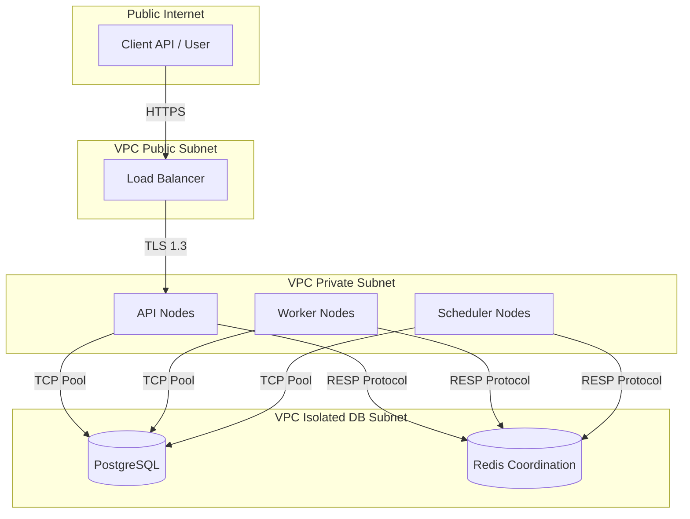
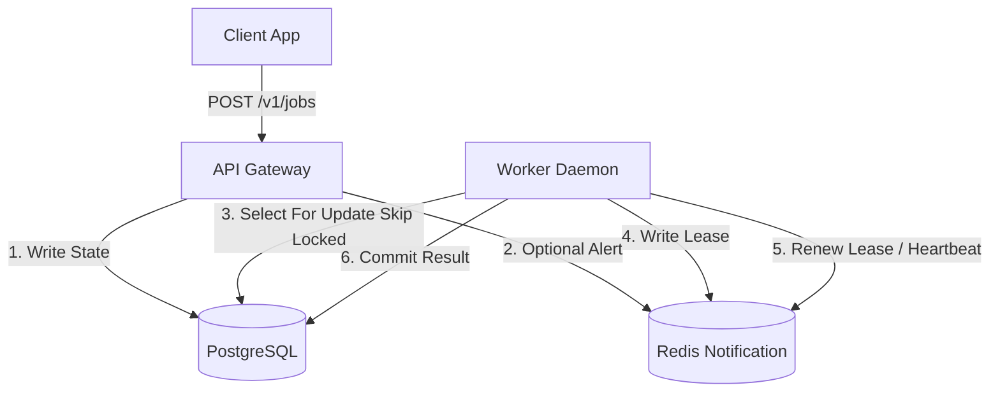

# High-Level Architecture Design

**Document Version**: 1.1.0  
**Status**: APPROVED  
**Author**: Principal Software Architect  
**Last Updated**: 2026-07-02

---

## Revision History

| Version | Date       | Description                                                 | Author              |
| :------ | :--------- | :---------------------------------------------------------- | :------------------ |
| 1.1.0   | 2026-07-02 | Remediation: PostgreSQL queue ownership & SQL lock claiming | Principal Architect |
| 1.0.0   | 2026-07-02 | Initial release for Architecture Review                     | Principal Architect |

---

## Table of Contents

1. [System Overview](#1-system-overview)
2. [Design Philosophy](#2-design-philosophy)
3. [Architectural Style](#3-architectural-style)
4. [Architectural Principles](#4-architectural-principles)
5. [Core Components](#5-core-components)
6. [Responsibilities](#6-responsibilities)
7. [External Dependencies](#7-external-dependencies)
8. [Trust Boundaries](#8-trust-boundaries)
9. [System Context](#9-system-context)

---

## 1. System Overview

The Distributed Job Scheduler is a platform designed to manage and execute asynchronous workloads across multiple queues. It decouples high-throughput task creation from background execution units (Workers). The architecture guarantees durability and strong consistency by maintaining all state, queues, and metadata within PostgreSQL.

## 2. Design Philosophy

- **Durability and Consistency First**: Avoid volatile queues. Job state is written and claimed inside a transactional ACID relational database.
- **Failures are Expected**: Design execution steps to tolerate network partitions, master reboots, or container crashes without losing job records.
- **Decoupled Execution**: Compute layers (APIs, Schedulers, and Workers) scale independently and coordinate status flows via PostgreSQL transactional state machines.

## 3. Architectural Style

We utilize a **decoupled, transactional-database driven** architectural style:

- PostgreSQL is the sole authoritative owner of Organizations, Projects, Queues, Jobs, Job Executions, Retry History, Dead Letter Queue, and Worker Metadata.
- Workers claim jobs directly from PostgreSQL using database transactions (`SELECT ... FOR UPDATE SKIP LOCKED`).
- Redis is utilized strictly for coordination: distributed locks, heartbeat tracking, cache, pub/sub, rate limiting, scheduler wake-up notifications, and ephemeral coordination state.

## 4. Architectural Principles

1. **PostgreSQL Authority**: PostgreSQL is the single source of truth for all job states, queues, and configurations.
2. **At-Least-Once Delivery**: No job execution state is lost. SQL row-level locks and Redis heartbeat leases guarantee task reclamation upon failure.
3. **Stateless Scale**: Compute nodes (APIs, Schedulers, Workers) hold zero local state.
4. **Strict Isolation**: Tenancy projects isolate queues and execution flows.

## 5. Core Components

- **API Gateway (`apps/api`)**: Gateway for task scheduling and system queries.
- **Scheduler Node (`apps/api` helper)**: Checks cron configurations and promotes delayed tasks directly in PostgreSQL.
- **Worker Daemon (`apps/worker`)**: Claims ready jobs from PostgreSQL and runs background payloads.
- **Dashboard UI (`apps/web`)**: Provides operator observability.

## 6. Responsibilities

- **API**: Token authentication, request validation, PostgreSQL writes.
- **Scheduler**: Scans scheduled jobs and promotes them to the `QUEUED` state directly in PostgreSQL. Pushes wake-up signals to Redis Pub/Sub.
- **Worker**: Transactional claims (`SELECT ... FOR UPDATE SKIP LOCKED`), heartbeat lock renewals (Redis), payload execution, and database result commits.

## 7. External Dependencies

- **PostgreSQL 16.x**: Authoritative database (queues, metadata, states).
- **Redis 7.x**: Distributed lock engine, heartbeat tracker, and wake-up notifier.
- **OAuth/JWT Provider**: External identity validating gateway access.

## 8. Trust Boundaries

## 9. System Context

The scheduler operates as an internal platform service coordinating asynchronous jobs:

