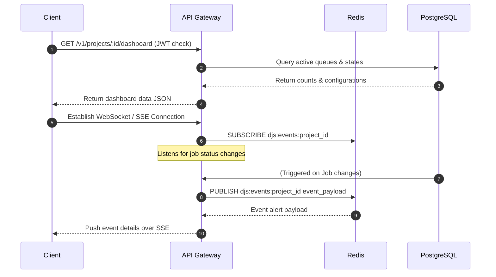

# Dashboard Synchronization Protocol

**Document Version**: 1.0.0  
**Status**: APPROVED  
**Author**: Principal Software Architect  
**Last Updated**: 2026-07-02

---

## Revision History

| Version | Date       | Description                                            | Author              |
| :------ | :--------- | :----------------------------------------------------- | :------------------ |
| 1.0.0   | 2026-07-02 | Initial release for Dashboard Synchronization Protocol | Principal Architect |

---

## Table of Contents

1. [Protocol Overview](#1-protocol-overview)
2. [Sequence Flow](#2-sequence-flow)
3. [Failure Handling & Recovery](#3-failure-handling--recovery)
4. [Security & Future Extensibility](#4-security--future-extensibility)

---

## 1. Protocol Overview

- **Purpose**: Displays real-time job execution statistics on the operator web dashboard.
- **Participants**: Dashboard Web Client, REST API Gateway, PostgreSQL Database, Redis Coordination Node (Pub/Sub).
- **Trigger**: Dashboard load or real-time event updates.
- **Inputs**: User token permissions, project identifier.
- **Outputs**: Job execution lists and metric logs.
- **State Changes**: None (read-only visualization).

---

## 2. Sequence Flow

---

## 3. Failure Handling & Recovery

- **WebSocket Reconnections**: If connection is lost, clients display connection error banners and attempt to reconnect.
- **Polling Fallback**: If SSE connections fail, clients fall back to querying the API gateway every 10 seconds.

---

## 4. Security & Future Extensibility

- **Security**: WebSocket connection requests must validate JWT credentials.
- **Extensibility**: Future updates can support user interface customizing tools.
