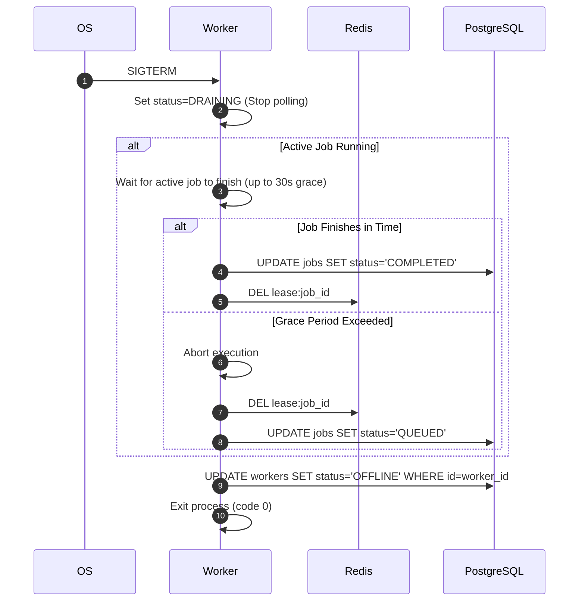

# Graceful Shutdown Protocol

**Document Version**: 1.0.0  
**Status**: APPROVED  
**Author**: Principal Software Architect  
**Last Updated**: 2026-07-02

---

## Revision History

| Version | Date       | Description                                    | Author              |
| :------ | :--------- | :--------------------------------------------- | :------------------ |
| 1.0.0   | 2026-07-02 | Initial release for Graceful Shutdown Protocol | Principal Architect |

---

## Table of Contents

1. [Protocol Overview](#1-protocol-overview)
2. [Sequence Flow](#2-sequence-flow)
3. [Failure Handling & Recovery](#3-failure-handling--recovery)
4. [Security & Future Extensibility](#4-security--future-extensibility)

---

## 1. Protocol Overview

- **Purpose**: Shuts down worker containers gracefully when they receive a `SIGTERM` signal, allowing active jobs to complete.
- **Participants**: Worker Daemon, PostgreSQL Database, Redis Coordination Node.
- **Trigger**: `SIGTERM` or `SIGINT` OS signal.
- **Inputs**: Shutdown signal.
- **Outputs**: Clean worker exit.
- **State Changes**: Releases active database locks and marks worker metadata as offline.

---

## 2. Sequence Flow

---

## 3. Failure Handling & Recovery

- **Abrupt Termination (SIGKILL)**: If the container is terminated abruptly, the Redis lease lock automatically expires after 30 seconds.
- **Cleaner Promotion**: Schedulers scan PostgreSQL for active jobs with expired Redis keys, resetting their state to `QUEUED`.

---

## 4. Security & Future Extensibility

- **Security**: Operations are restricted to database row levels.
- **Extensibility**: Future updates can support dynamic grace periods configured at the queue level.
