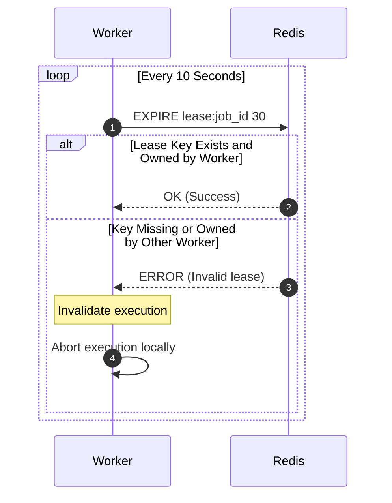

# Heartbeat Protocol

**Document Version**: 1.0.0  
**Status**: APPROVED  
**Author**: Principal Software Architect  
**Last Updated**: 2026-07-02

---

## Revision History

| Version | Date       | Description                            | Author              |
| :------ | :--------- | :------------------------------------- | :------------------ |
| 1.0.0   | 2026-07-02 | Initial release for Heartbeat Protocol | Principal Architect |

---

## Table of Contents

1. [Protocol Overview](#1-protocol-overview)
2. [Sequence Flow](#2-sequence-flow)
3. [Failure Handling & Recovery](#3-failure-handling--recovery)
4. [Security & Future Extensibility](#4-security--future-extensibility)

---

## 1. Protocol Overview

- **Purpose**: Verifies that a worker executing a job is healthy. Renews the execution lease in Redis.
- **Participants**: Worker Daemon, Redis Coordination Node.
- **Trigger**: Periodic timer (every 10 seconds) during active job execution.
- **Inputs**: `job_id`, `worker_id`, `lease_duration`.
- **Outputs**: Heartbeat acknowledgment (success/fail).
- **State Changes**: Updates Redis lease TTL values.

---

## 2. Sequence Flow

---

## 3. Failure Handling & Recovery

- **Connection Failure**: If the worker cannot reach Redis, it retries every 2 seconds. If connections fail for 3 consecutive attempts (15 seconds total), the worker aborts execution and releases database row locks (safe fail).
- **Lease Expiration Recovery**: Cleaners detect expired Redis lease keys, update job status to `QUEUED` in PostgreSQL, and log the failover.

---

## 4. Security & Future Extensibility

- **Security**: Lock keys are restricted to namespaced scopes (`lease:{job_id}`). Workers can only update locks matching their `worker_id`.
- **Extensibility**: Future phases can add payload size offsets to dynamic heartbeat intervals.
