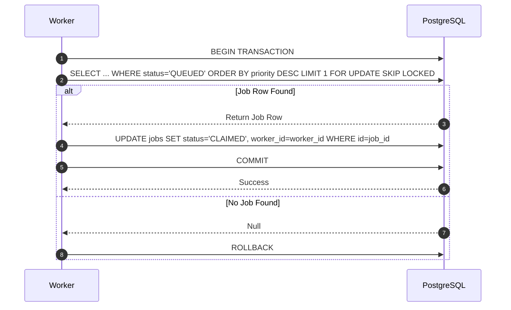

# Job Claim Protocol

**Document Version**: 1.0.0  
**Status**: APPROVED  
**Author**: Principal Software Architect  
**Last Updated**: 2026-07-02

---

## Revision History

| Version | Date       | Description                            | Author              |
| :------ | :--------- | :------------------------------------- | :------------------ |
| 1.0.0   | 2026-07-02 | Initial release for Job Claim Protocol | Principal Architect |

---

## Table of Contents

1. [Protocol Overview](#1-protocol-overview)
2. [Sequence Flow](#2-sequence-flow)
3. [Failure Handling & Recovery](#3-failure-handling--recovery)
4. [Security & Future Extensibility](#4-security--future-extensibility)

---

## 1. Protocol Overview

- **Purpose**: Atomically claims the next eligible job from PostgreSQL using database transactions.
- **Participants**: Worker Daemon, PostgreSQL Database.
- **Trigger**: Polling loop check.
- **Inputs**: `queue_name`, `worker_id`.
- **Outputs**: Job payload row (or null if empty).
- **State Changes**: Transitions job state from `QUEUED` to `CLAIMED` or `RUNNING`.

---

## 2. Sequence Flow

---

## 3. Failure Handling & Recovery

- **Deadlocks**: The `SKIP LOCKED` clause prevents concurrent transactions from waiting on locked rows, avoiding database deadlocks.
- **Transaction Rollback**: If a worker crashes before committing the claim update, the database automatically rolls back the transaction, releasing the row lock.

---

## 4. Security & Future Extensibility

- **Security**: Database connections use TLS 1.3 with restricted parameters.
- **Extensibility**: Future updates can add support for tenant-specific priority weighting.
