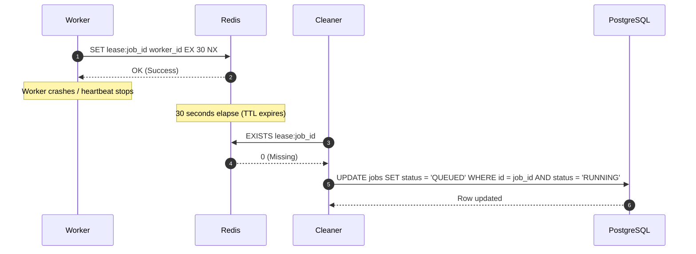

# Lease Protocol

**Document Version**: 1.0.0  
**Status**: APPROVED  
**Author**: Principal Software Architect  
**Last Updated**: 2026-07-02

---

## Revision History

| Version | Date       | Description                        | Author              |
| :------ | :--------- | :--------------------------------- | :------------------ |
| 1.0.0   | 2026-07-02 | Initial release for Lease Protocol | Principal Architect |

---

## Table of Contents

1. [Protocol Overview](#1-protocol-overview)
2. [Sequence Flow](#2-sequence-flow)
3. [Failure Handling & Recovery](#3-failure-handling--recovery)
4. [Security & Future Extensibility](#4-security--future-extensibility)

---

## 1. Protocol Overview

- **Purpose**: Creates an execution lock in Redis mapping a job to a specific worker, preventing split-brain execution.
- **Participants**: Worker Daemon, Redis, Cleaner Service.
- **Trigger**: Successful database job claim.
- **Inputs**: `job_id`, `worker_id`, `lease_ttl` (default 30 seconds).
- **Outputs**: Lease registration confirmation.
- **State Changes**: Writes `lease:{job_id}` in Redis.

---

## 2. Sequence Flow

---

## 3. Failure Handling & Recovery

- **Collision**: If a lease key already exists in Redis, the write fails, prompting the worker to abort the transaction and release database row locks.
- **Reconciliation**: A background task periodically scans PostgreSQL for active jobs with expired Redis keys, resetting their state to `QUEUED`.

---

## 4. Security & Future Extensibility

- **Security**: Leases are stored as cryptographically hashed keys.
- **Extensibility**: Future phases can support custom lease durations configured at the project queue level.
