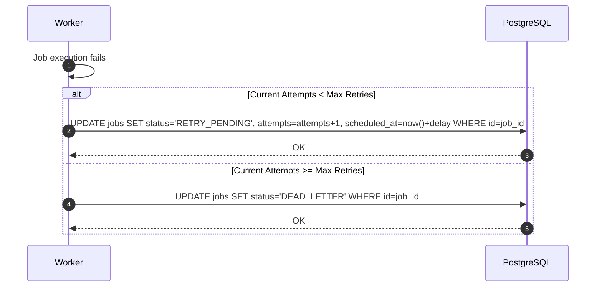

# Retry Protocol

**Document Version**: 1.0.0  
**Status**: APPROVED  
**Author**: Principal Software Architect  
**Last Updated**: 2026-07-02

---

## Revision History

| Version | Date       | Description                        | Author              |
| :------ | :--------- | :--------------------------------- | :------------------ |
| 1.0.0   | 2026-07-02 | Initial release for Retry Protocol | Principal Architect |

---

## Table of Contents

1. [Protocol Overview](#1-protocol-overview)
2. [Sequence Flow](#2-sequence-flow)
3. [Failure Handling & Recovery](#3-failure-handling--recovery)
4. [Security & Future Extensibility](#4-security--future-extensibility)

---

## 1. Protocol Overview

- **Purpose**: Schedules job retries with exponential backoffs when executions fail.
- **Participants**: Worker Daemon, PostgreSQL Database.
- **Trigger**: Job execution failure.
- **Inputs**: `job_id`, `max_retries`, `current_attempts`, `backoff_factor`.
- **Outputs**: Job state updated.
- **State Changes**: Transitions job state to `RETRY_PENDING` or `DEAD_LETTER`.

---

## 2. Sequence Flow

---

## 3. Failure Handling & Recovery

- **Database Connectivity Issues**: If a worker cannot update the job status in PostgreSQL during execution failure, the Redis lease expires, prompting the cleaner service to reschedule the job.

---

## 4. Security & Future Extensibility

- **Security**: Prevent log injection by sanitizing error messages before writing them to the database.
- **Extensibility**: Future updates can support dynamic retry strategies (e.g. circuit breakers).
