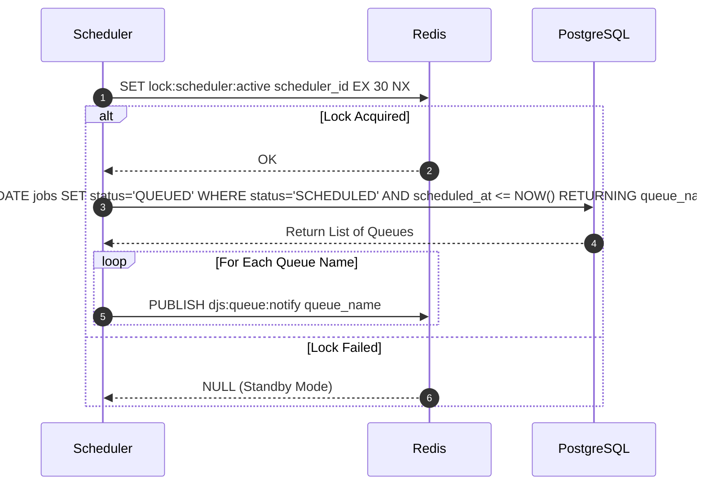

# Scheduler Promotion Protocol

**Document Version**: 1.0.0  
**Status**: APPROVED  
**Author**: Principal Software Architect  
**Last Updated**: 2026-07-02

---

## Revision History

| Version | Date       | Description                                      | Author              |
| :------ | :--------- | :----------------------------------------------- | :------------------ |
| 1.0.0   | 2026-07-02 | Initial release for Scheduler Promotion Protocol | Principal Architect |

---

## Table of Contents

1. [Protocol Overview](#1-protocol-overview)
2. [Sequence Flow](#2-sequence-flow)
3. [Failure Handling & Recovery](#3-failure-handling--recovery)
4. [Security & Future Extensibility](#4-security--future-extensibility)

---

## 1. Protocol Overview

- **Purpose**: Evaluates scheduled tasks and promotes eligible jobs to the `QUEUED` state.
- **Participants**: Scheduler Node, PostgreSQL Database, Redis Coordination Node.
- **Trigger**: Periodic schedule check (every 10 seconds).
- **Inputs**: Database server current time.
- **Outputs**: Status updates in PostgreSQL, wake-up alerts in Redis.
- **State Changes**: Transitions jobs from `SCHEDULED` to `QUEUED`.

---

## 2. Sequence Flow

---

## 3. Failure Handling & Recovery

- **Active Scheduler Crash**: If the active scheduler node fails to renew the lock, a standby node acquires it and assumes scheduling duties.
- **Lost Wake-up Signals**: Workers poll PostgreSQL periodically to ensure no jobs are missed if a Redis Pub/Sub signal is lost.

---

## 4. Security & Future Extensibility

- **Security**: Lock keys are restricted to namespaced scopes.
- **Extensibility**: Future updates can support dynamic scheduling boundaries.
