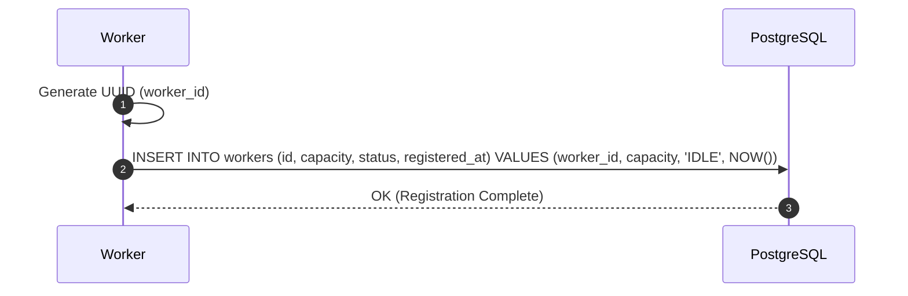

# Worker Registration Protocol

**Document Version**: 1.0.0  
**Status**: APPROVED  
**Author**: Principal Software Architect  
**Last Updated**: 2026-07-02

---

## Revision History

| Version | Date       | Description                                      | Author              |
| :------ | :--------- | :----------------------------------------------- | :------------------ |
| 1.0.0   | 2026-07-02 | Initial release for Worker Registration Protocol | Principal Architect |

---

## Table of Contents

1. [Protocol Overview](#1-protocol-overview)
2. [Sequence Flow](#2-sequence-flow)
3. [Failure Handling & Recovery](#3-failure-handling--recovery)
4. [Security & Future Extensibility](#4-security--future-extensibility)

---

## 1. Protocol Overview

- **Purpose**: Registers worker instances and capacities upon container startup.
- **Participants**: Worker Daemon, PostgreSQL Database.
- **Trigger**: Worker container startup.
- **Inputs**: `worker_id`, `max_concurrency_capacity`, `supported_queues`.
- **Outputs**: Registration confirmation.
- **State Changes**: Adds a worker row to the database.

---

## 2. Sequence Flow

---

## 3. Failure Handling & Recovery

- **Registration Failures**: If the registration insert fails, the worker exits, triggering container orchestrator restarts.
- **Dangling Metadata Cleanup**: If a worker crashes, the cleaner node updates its status to `OFFLINE` in PostgreSQL.

---

## 4. Security & Future Extensibility

- **Security**: Database connections use TLS 1.3 with restricted parameters.
- **Extensibility**: Future updates can support dynamic concurrency limits (e.g. auto-scaling).
