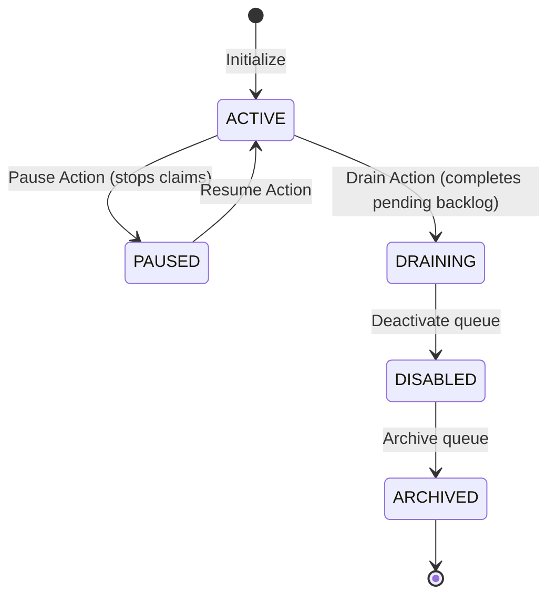

# Queue Architecture Design

**Document Version**: 1.1.0  
**Status**: APPROVED  
**Author**: Principal Software Architect  
**Last Updated**: 2026-07-02

---

## Revision History

| Version | Date       | Description                                                 | Author              |
| :------ | :--------- | :---------------------------------------------------------- | :------------------ |
| 1.1.0   | 2026-07-02 | Remediation: PostgreSQL queue ownership & SQL lock claiming | Principal Architect |
| 1.0.0   | 2026-07-02 | Initial release for Architecture Review                     | Principal Architect |

---

## Table of Contents

1. [Queue Isolation & Partitioning](#1-queue-isolation--partitioning)
2. [Priority & Concurrency Handling](#2-priority--concurrency-handling)
3. [Queue Lifecycles & Administrative Actions](#3-queue-lifecycles--administrative-actions)

---

## 1. Queue Isolation & Partitioning

To prevent tenant starvation and support varying qualities of service, queues are isolated using namespaced path routing inside PostgreSQL tables:

- **Tenancy Scoping**: Jobs are partitioned by `organization_id`, `project_id`, and `queue_name`.
- **Database Partitioning**: Job tables inside PostgreSQL are range-partitioned by `project_id` and `created_at` timestamp ranges to keep indexes small and queries efficient.
- **Why this design improves durability**: By avoiding in-memory Redis Lists, jobs can never be lost due to volatile memory crashes. PostgreSQL transaction logs write-ahead logs (WAL) guarantee durability.

---

## 2. Priority & Concurrency Handling

### 2.1. Priority Channels

Each queue configuration supports three priority levels: `high`, `default`, and `low`.

- Instead of Redis list polling, workers query PostgreSQL sorting by priority value:
  ```sql
  SELECT id FROM jobs
  WHERE queue_name = $1 AND status = 'QUEUED'
  ORDER BY priority DESC, created_at ASC
  LIMIT 1
  FOR UPDATE SKIP LOCKED;
  ```
- This ensures high-priority tasks are claimed immediately before default or low-priority items.

### 2.2. Concurrency Boundaries

- **Queue limits**: A maximum active task ceiling configuration prevents a queue from exhausting database connections (e.g. max 10 concurrent processes).
- **Tenant limits**: Limits the total number of running tasks per organization project. Enforced via database triggers or active transaction count checks.

---

## 3. Queue Lifecycles & Administrative Actions

### 3.1. Pause & Resume Mechanics

- When a queue is **PAUSED**, its state is updated in the PostgreSQL database.
- Workers filter out paused queues from their claim queries.
- Active executing jobs continue running until completion.

### 3.2. Draining & Archiving

- **Draining**: Queue stops accepting new job submissions but allows active workers to clear the remaining backlog.
- **Archiving**: The queue state transitions to `ARCHIVED` in PostgreSQL, indicating it is decommissioned. Historical execution logs remain readable.

### 3.3. Queue State Diagram


