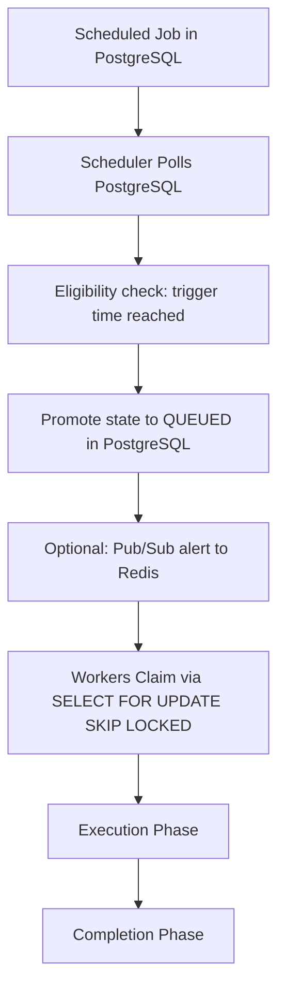

# Scheduler Architecture Design

**Document Version**: 1.1.0  
**Status**: APPROVED  
**Author**: Principal Software Architect  
**Last Updated**: 2026-07-02

---

## Revision History

| Version | Date       | Description                                                 | Author              |
| :------ | :--------- | :---------------------------------------------------------- | :------------------ |
| 1.1.0   | 2026-07-02 | Remediation: PostgreSQL queue ownership & SQL lock claiming | Principal Architect |
| 1.0.0   | 2026-07-02 | Initial release for Architecture Review                     | Principal Architect |

---

## Table of Contents

1. [Scheduler Operational Lifecycle](#1-scheduler-operational-lifecycle)
2. [Active-Passive Coordination & Failover](#2-active-passive-coordination--failover)
3. [Time Synchronization & Clock Drift Mitigation](#3-time-synchronization--clock-drift-mitigation)

---

## 1. Scheduler Operational Lifecycle

The scheduler is responsible for scanning cron profiles and promoting delayed tasks. The lifecycle follows a database-driven pipeline:

### 1.1. Ingestion & Promotion Pipeline

1. **Scheduled Job**: Delayed and recurring cron jobs exist inside PostgreSQL as metadata rows with a `scheduled_at` timestamp.
2. **Scheduler Poll**: Every 10 seconds, the active scheduler queries PostgreSQL.
3. **Eligibility Check**: Evaluates if the `scheduled_at` timestamp is `<=` the current database server UTC time.
4. **Promote into Queue**: The scheduler updates the job status to `QUEUED` directly in PostgreSQL.
5. **Worker Alert**: The scheduler publishes a wake-up message to a Redis Pub/Sub channel (`djs:queue:notify`). This acts as an alert for idle workers, prompting them to poll PostgreSQL.
6. **No Redis Enqueuing**: Schedulers do NOT write or push job payloads/IDs to Redis lists or streams.

---

## 2. Active-Passive Coordination & Failover

To prevent duplicate job promotion, only one scheduler container node runs the promotion query at a time:

- **Active Lock**: Schedulers acquire a distributed lock in Redis (`lock:scheduler:active`) with a lease duration of 30 seconds.
- **Failover**: If the active scheduler node fails to renew the lock, a standby node acquires it and assumes scheduling duties.

---

## 3. Time Synchronization & Clock Drift Mitigation

- **Standard reference timezone**: UTC.
- **NTP Synchronization**: Every scheduler node runs an NTP daemon. Clock drift exceeding `50ms` triggers critical system alerts.
- **Buffer Windows**: Schedulers query jobs scheduled up to 1 second in the past to compensate for minor clock skew.
