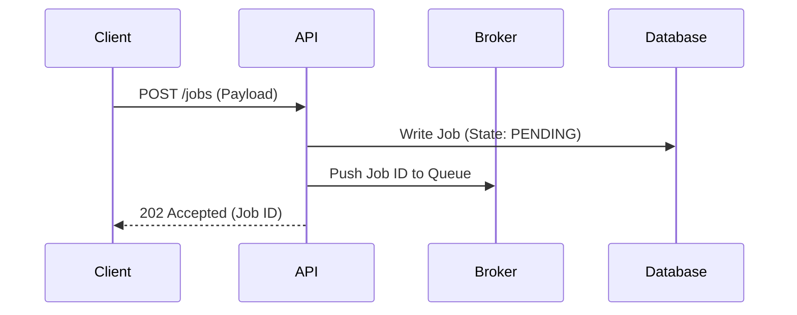
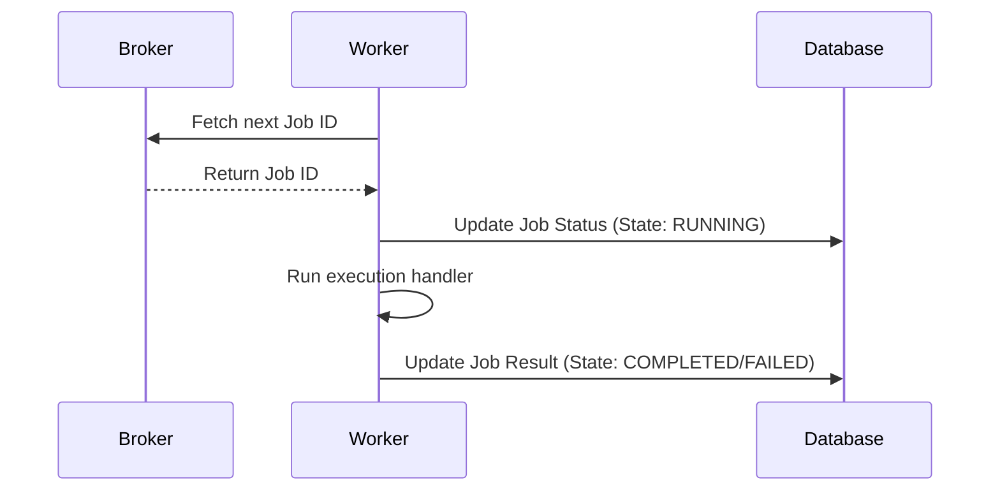

# Sequence Diagrams

This document illustrates sequence flows for major actions in the system.

## 1. Job Ingestion Sequence

```mermaid
sequenceDiagram
    participant Client
    participant API
    participant Broker
    participant Database

    Client->>API: POST /jobs (Payload)
    API->>Database: Write Job (State: PENDING)
    API->>Broker: Push Job ID to Queue
    API-->>Client: 202 Accepted (Job ID)
```

## 2. Job Execution Sequence

```mermaid
sequenceDiagram
    participant Broker
    participant Worker
    participant Database

    Worker->>Broker: Fetch next Job ID
    Broker-->>Worker: Return Job ID
    Worker->>Database: Update Job Status (State: RUNNING)
    Worker->>Worker: Run execution handler
    Worker->>Database: Update Job Result (State: COMPLETED/FAILED)
```
