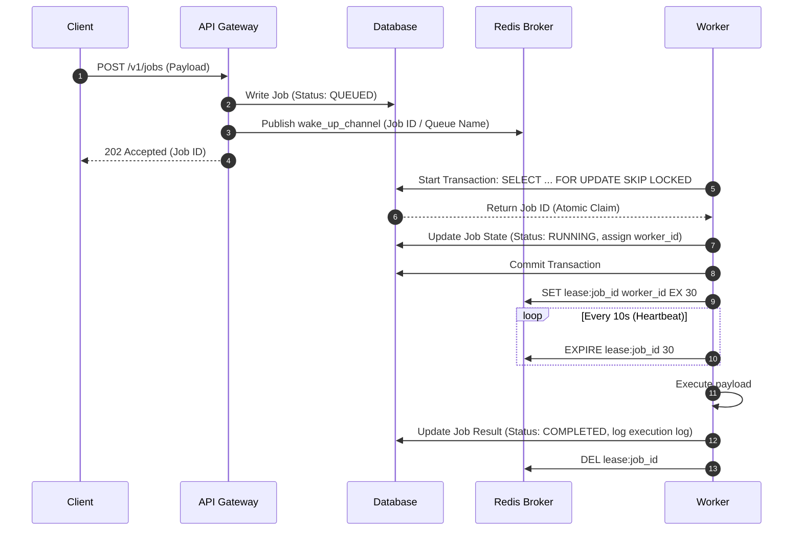
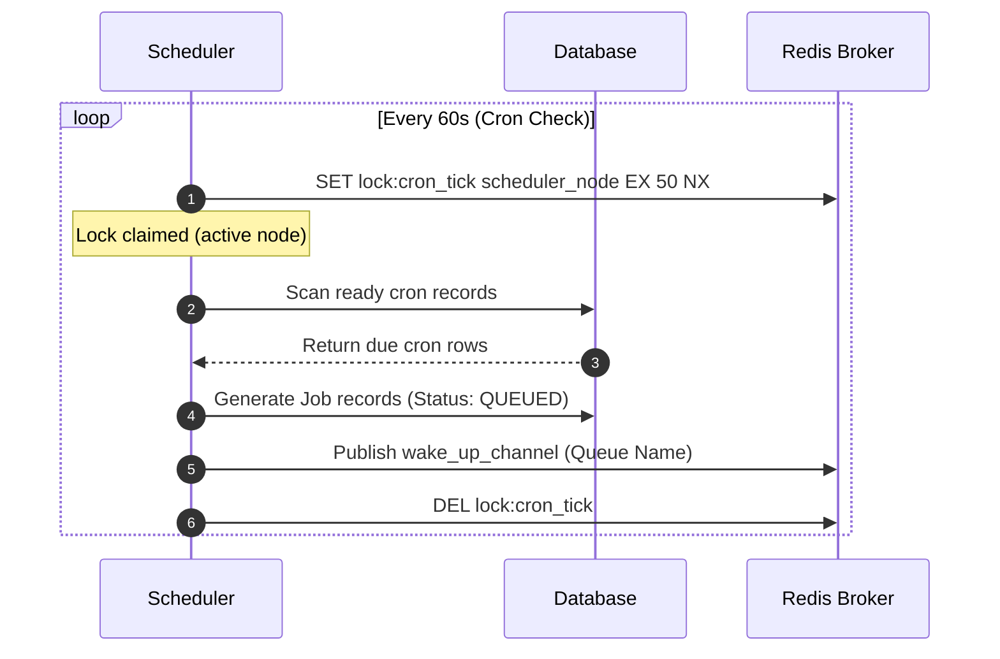

# Service Communication Design

**Document Version**: 1.1.0  
**Status**: APPROVED  
**Author**: Principal Software Architect  
**Last Updated**: 2026-07-02

---

## Revision History

| Version | Date       | Description                                                 | Author              |
| :------ | :--------- | :---------------------------------------------------------- | :------------------ |
| 1.1.0   | 2026-07-02 | Remediation: PostgreSQL queue ownership & SQL lock claiming | Principal Architect |
| 1.0.0   | 2026-07-02 | Initial release for Architecture Review                     | Principal Architect |

---

## Table of Contents

1. [Communication Patterns](#1-communication-patterns)
2. [Sequence Flows](#2-sequence-flows)
3. [Future Event-Driven Opportunities](#3-future-event-driven-opportunities)

---

## 1. Communication Patterns

### 1.1. Synchronous Communication

- **Client to API**: HTTPS JSON REST calls (`POST`, `GET`, `PATCH`).
- **Dashboard to API**: HTTPS REST requests and WebSockets/SSE connections for real-time monitoring streams.

### 1.2. Asynchronous Communication

- **API to Database (PostgreSQL)**: Jobs are written directly to PostgreSQL.
- **Worker Polling (PostgreSQL)**: Workers poll PostgreSQL directly using transaction blocks wrapping `SELECT ... FOR UPDATE SKIP LOCKED` queries.
- **Scheduler to Redis**: Schedulers push optional wake-up signals (Pub/Sub) to Redis to notify idle workers that new jobs are ready in PostgreSQL.

### 1.3. Database & Cache Interactions

- **PostgreSQL**: Master storage for jobs, queues, logs, and metadata. SQL client pools connect directly to DB nodes.
- **Redis**: Ephemeral coordination only. Handles distributed locks, rate-limiting, and heartbeat leases. No permanent job data is stored in Redis.

### 1.4. Worker Heartbeat Communication

- **Worker to Redis**: Every 10 seconds, the worker updates its task lease expiration key in Redis (`lease:{job_id}`) using `SET EX` or `PEXPIRE`.

---

## 2. Sequence Flows

### 2.1. Immediate Job Ingestion & Execution Flow

### 2.2. Scheduler Cron Trigger Flow

---

## 3. Future Event-Driven Opportunities

- **Event Sourcing Integration**: In future phases, job state changes can be published to an Apache Kafka or AWS Kinesis stream, enabling other internal microservices to consume events asynchronously.
- **Notification Fan-out**: Integrating an event broker allows fan-out triggers to send notifications (webhooks, emails) on job failures without blocking worker execution.
