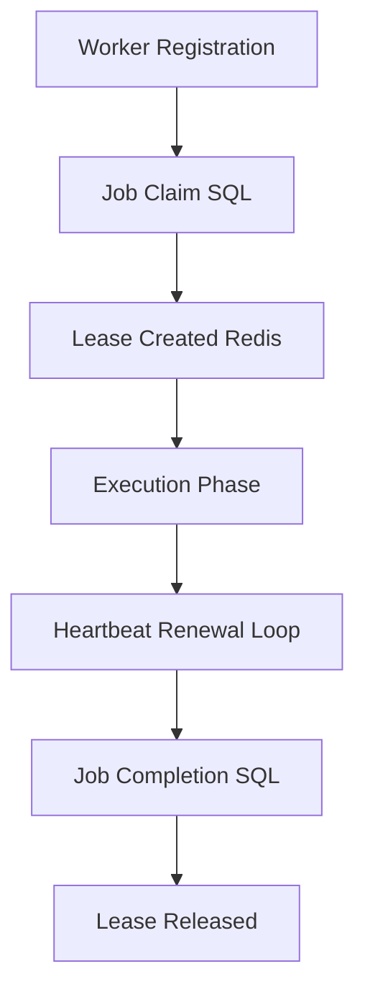
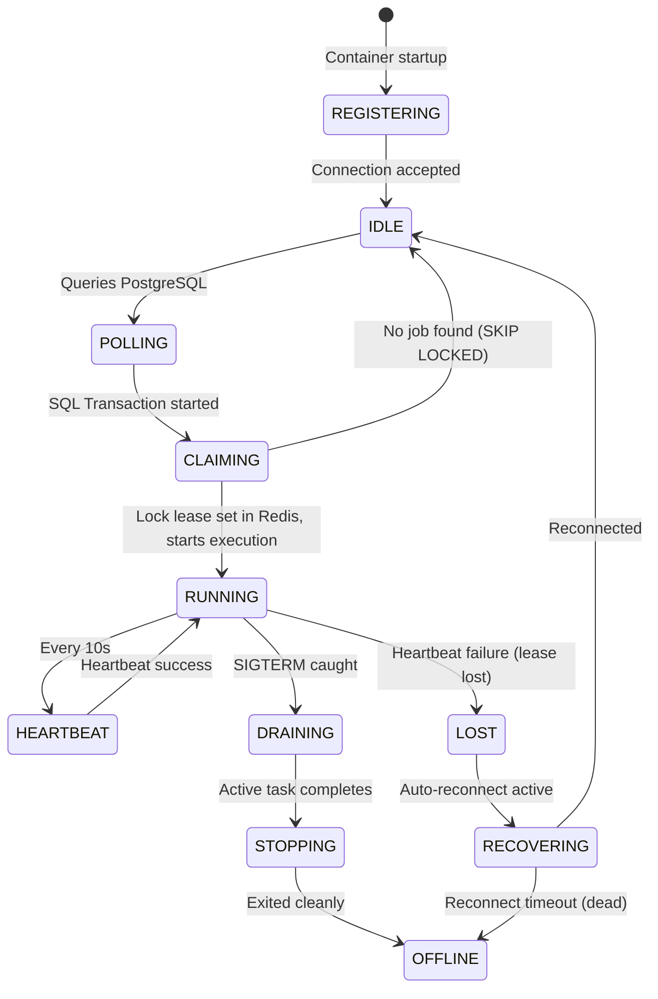

# Worker Architecture Design

**Document Version**: 1.1.0  
**Status**: APPROVED  
**Author**: Principal Software Architect  
**Last Updated**: 2026-07-02

---

## Revision History

| Version | Date       | Description                                                 | Author              |
| :------ | :--------- | :---------------------------------------------------------- | :------------------ |
| 1.1.0   | 2026-07-02 | Remediation: PostgreSQL queue ownership & SQL lock claiming | Principal Architect |
| 1.0.0   | 2026-07-02 | Initial release for Architecture Review                     | Principal Architect |

---

## Table of Contents

1. [Worker Lifecycle & Claiming Mechanics](#1-worker-lifecycle--claiming-mechanics)
2. [Explicit Lease Lifecycle](#2-explicit-lease-lifecycle)
3. [Worker State Machine Diagram](#3-worker-state-machine-diagram)
4. [Graceful Shutdown & Crash Recovery](#4-graceful-shutdown--crash-recovery)

---

## 1. Worker Lifecycle & Claiming Mechanics

### 1.1. Registration

Upon container startup, the worker daemon generates a UUID and registers its capacity (max concurrent jobs) directly to the PostgreSQL `workers` metadata table. It transitions its state to `IDLE` and begins the polling loop.

### 1.2. Transactional Claiming via SELECT FOR UPDATE SKIP LOCKED

Instead of Redis queue lists, workers query PostgreSQL using transactional row-level locks. This claiming operation is fully atomic and prevents multiple workers from claiming the same job:

```sql
BEGIN;
SELECT id, payload
FROM jobs
WHERE status = 'QUEUED' AND queue_name = $1
ORDER BY priority DESC, created_at ASC
LIMIT 1
FOR UPDATE SKIP LOCKED;

-- If a row is returned:
UPDATE jobs
SET status = 'CLAIMED', worker_id = $2, claimed_at = NOW()
WHERE id = $3;
COMMIT;
```

---

## 2. Explicit Lease Lifecycle

Once a worker claims a job, it enters the **Lease Lifecycle**:



### 2.1. Lease Creation & Ownership

- **Lease Creation**: Upon committing the SQL claim, the worker writes a lease key in Redis (`lease:{job_id}`) mapping to its `worker_id` with a fixed Time-To-Live (TTL) (default 30 seconds).
- **Lease Ownership**: The worker holds exclusive rights to execute the task payload. Any write attempts back to PostgreSQL check if the worker still holds the lease.

### 2.2. Heartbeat Renewal

- During execution, the worker runs a background timer loop that sends a heartbeat to Redis every 10 seconds, extending the TTL of `lease:{job_id}` by 30 seconds.

### 2.3. Lease Timeout & Invalidation

- **Lease Timeout**: If the worker container crashes, heartbeats stop, and the Redis lease key automatically expires after 30 seconds.
- **Lease Invalidation**: If the worker attempts to heartbeat or write results after its lease has expired and been reclaimed by another worker, the database check rejects the write, invalidating the worker's execution attempt.

### 2.4. Lease Recovery

- The active scheduler or cleaner node periodically scans PostgreSQL for jobs in `RUNNING` or `CLAIMED` states where the corresponding Redis lease key has expired. The cleaner aborts the execution attempt and returns the job to `QUEUED` state.

---

## 3. Worker State Machine Diagram



---

## 4. Graceful Shutdown & Crash Recovery

### 4.1. Graceful Shutdown (SIGTERM)

- Upon catching `SIGTERM`, the worker transitions to `DRAINING` state.
- The polling loop stops claiming new tasks.
- The active running job is allowed to complete. If it does not finish within the grace period (e.g. 30 seconds), the execution is aborted.

### 4.2. Crash Recovery

- Handled via the **Lease Recovery** mechanism described above. Expired worker leases are automatically cleaned and rescheduled.
