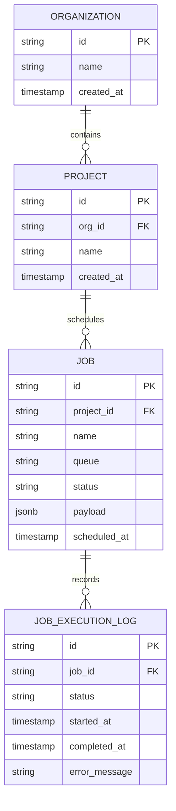

# ER Diagram

This document contains entity-relationship structures mapping key data stores.

## 1. Schema Outlines

```mermaid
erDiagram
    ORGANIZATION ||--o{ PROJECT : contains
    PROJECT ||--o{ JOB : schedules
    JOB ||--o{ JOB_EXECUTION_LOG : records

    ORGANIZATION {
        string id PK
        string name
        timestamp created_at
    }

    PROJECT {
        string id PK
        string org_id FK
        string name
        timestamp created_at
    }

    JOB {
        string id PK
        string project_id FK
        string name
        string queue
        string status
        jsonb payload
        timestamp scheduled_at
    }

    JOB_EXECUTION_LOG {
        string id PK
        string job_id FK
        string status
        timestamp started_at
        timestamp completed_at
        string error_message
    }
```
