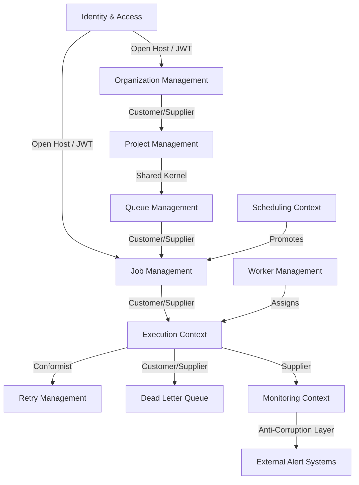

# Context Map Specifications

**Document Version**: 1.0.0  
**Status**: APPROVED  
**Author**: Principal Software Architect  
**Last Updated**: 2026-07-02

---

## Revision History

| Version | Date       | Description                         | Author              |
| :------ | :--------- | :---------------------------------- | :------------------ |
| 1.0.0   | 2026-07-02 | Initial release for DDD Context Map | Principal Architect |

---

## Table of Contents

1. [Bounded Context Relationships](#1-bounded-context-relationships)
2. [Context Map Diagram](#2-context-map-diagram)

---

## 1. Bounded Context Relationships

To ensure clean communication boundaries, contexts use specific domain relationships:

### 1.1. Customer-Supplier

- **Job Management (Supplier) → Execution (Customer)**: Job Management provides the validated job payload definitions that the Execution context claims and executes.

### 1.2. Shared Kernel

- **Project Management ↔ Queue Management**: Share core domain models defining environment variables and namespace paths.

### 1.3. Published Language / Open Host Service (OHS)

- **Identity & Access Context**: Acts as an Open Host Service (OHS), providing a Published Language (JSON Web Tokens - JWT) that other contexts use to authorize API calls.

### 1.4. Conformist

- **Execution Context → Retry Management Context**: Retry Management conforms to the status interfaces exposed by the Execution context.

### 1.5. Anti-Corruption Layer (ACL)

- **Monitoring Context → Third-Party Alerting**: Integrates external webhooks or alerting services (Slack, PagerDuty) through an Anti-Corruption Layer (ACL) translation module.

---

## 2. Context Map Diagram

