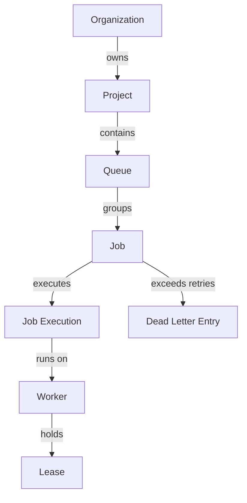

# Domain Overview

**Document Version**: 1.0.0  
**Status**: APPROVED  
**Author**: Principal Software Architect  
**Last Updated**: 2026-07-02

---

## Revision History

| Version | Date       | Description                           | Author              |
| :------ | :--------- | :------------------------------------ | :------------------ |
| 1.0.0   | 2026-07-02 | Initial release for DDD Domain Review | Principal Architect |

---

## Table of Contents

1. [Business Purpose & Domain Vision](#1-business-purpose--domain-vision)
2. [Core Business Concepts](#2-core-business-concepts)
3. [Business Capabilities](#3-business-capabilities)
4. [Domain Boundaries & Workflow Flows](#4-domain-boundaries--workflow-flows)
5. [High-Level Domain Model Diagram](#5-high-level-domain-model-diagram)

---

## 1. Business Purpose & Domain Vision

The Distributed Job Scheduler platform provides reliable, durable, and highly observable asynchronous background execution. The core domain vision is to decouple task scheduling from processing runtimes, ensuring execution guarantees, system invariants enforcement, and tenant isolation across multiple queues.

---

## 2. Core Business Concepts

- **Multi-Tenancy Partitioning**: Segmenting execution contexts using organizations and projects.
- **Queue Management**: Organizing, rate limiting, pausing, and resuming task channels.
- **Job Lifecycle**: Tracking state transitions from schedule trigger to worker claim, run, completion, or DLQ quarantine.
- **Worker Coordination**: Tracking worker heartbeats, registrations, capacity, and active execution leases.

---

## 3. Business Capabilities

1. **Ingestion & Validation**: High-throughput api entry validating job payload schemas.
2. **Scheduling Promotion**: Chron tick evaluation promoting scheduled or recurring jobs.
3. **Execution Routing**: Transactional claiming and assignment to active worker nodes.
4. **Resilience & Backoff**: Automatic retry scheduling, exponential backoffs, and dead letter routing.

---

## 4. Domain Boundaries & Workflow Flows

- **Ingestion Boundary**: Clients submit job parameters. The API gateway creates the metadata record and commits it.
- **Promotion Boundary**: The scheduler monitors time boundaries and promotes eligible scheduled or cron records to active queued states.
- **Claiming Boundary**: Active worker nodes run transaction loops, select queued rows via pessimistic row-level locking, and lock the job lease.
- **Execution Boundary**: Runtimes execute payloads, maintain leases via heartbeats, and commit completion results.

---

## 5. High-Level Domain Model Diagram

