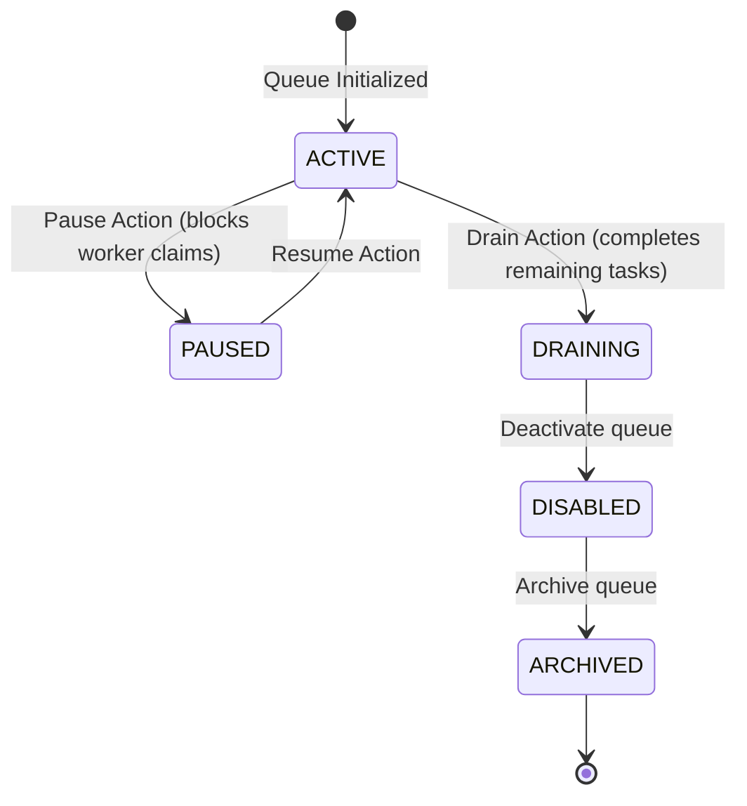
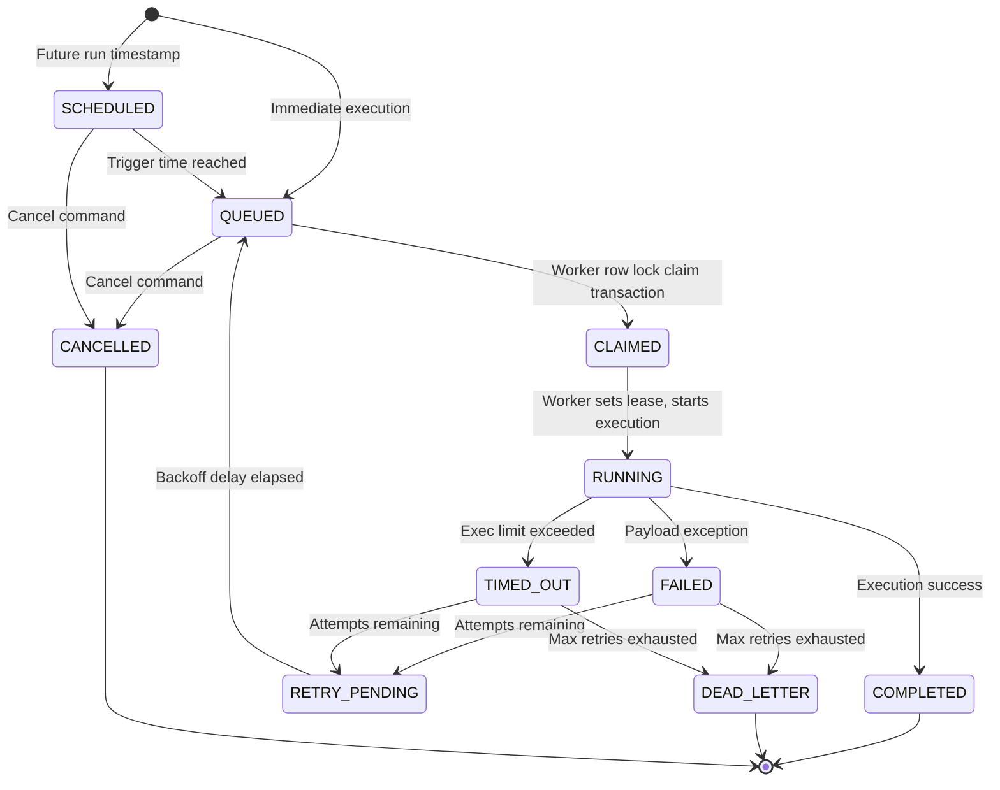
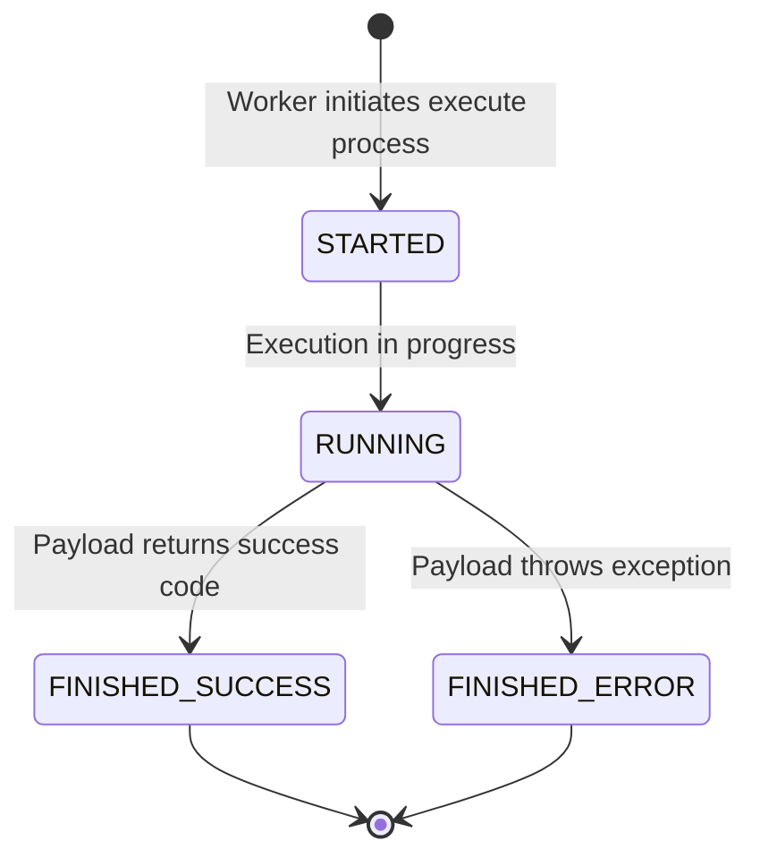
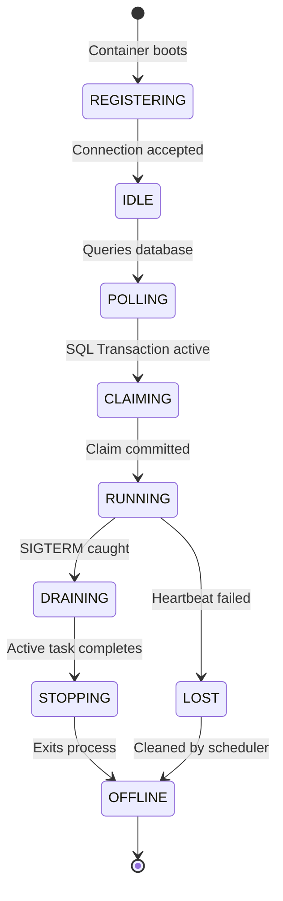
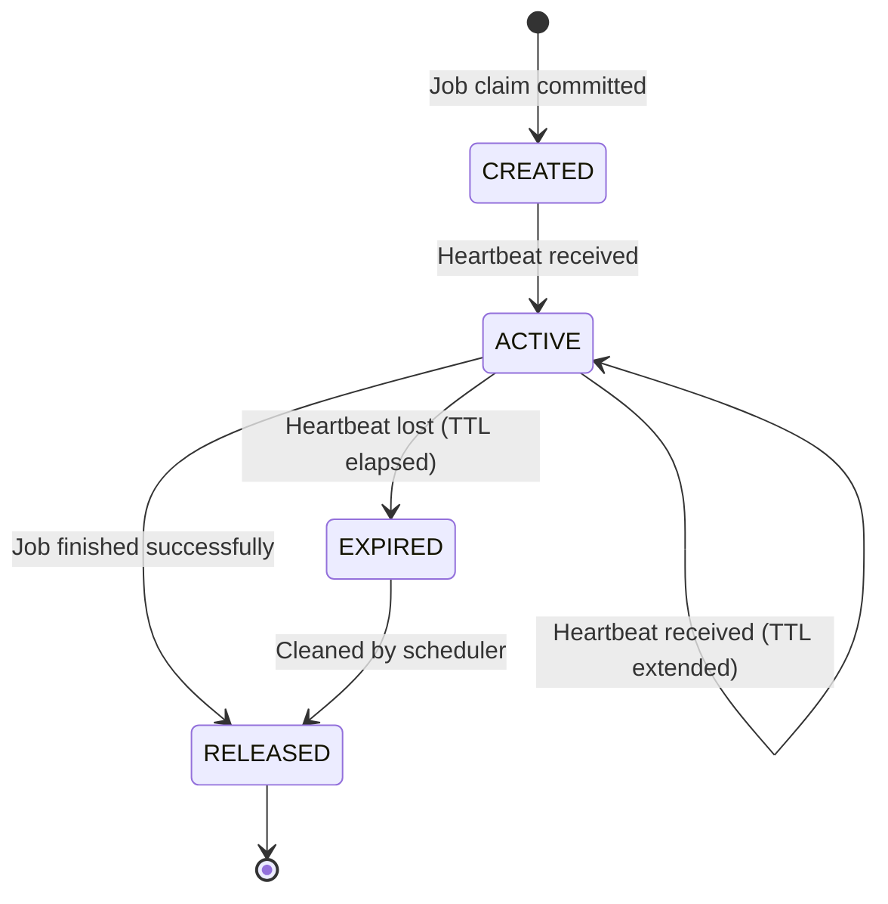

# Entity Lifecycles Specifications

**Document Version**: 1.0.0  
**Status**: APPROVED  
**Author**: Principal Software Architect  
**Last Updated**: 2026-07-02

---

## Revision History

| Version | Date       | Description                               | Author              |
| :------ | :--------- | :---------------------------------------- | :------------------ |
| 1.0.0   | 2026-07-02 | Initial release for DDD Entity Lifecycles | Principal Architect |

---

## Table of Contents

1. [Queue Entity Lifecycle](#1-queue-entity-lifecycle)
2. [Job Entity Lifecycle](#2-job-entity-lifecycle)
3. [JobExecution Entity Lifecycle](#3-jobexecution-entity-lifecycle)
4. [Worker Entity Lifecycle](#4-worker-entity-lifecycle)
5. [Lease Entity Lifecycle](#5-lease-entity-lifecycle)

---

## 1. Queue Entity Lifecycle

---

## 2. Job Entity Lifecycle

---

## 3. JobExecution Entity Lifecycle

---

## 4. Worker Entity Lifecycle

---

## 5. Lease Entity Lifecycle

